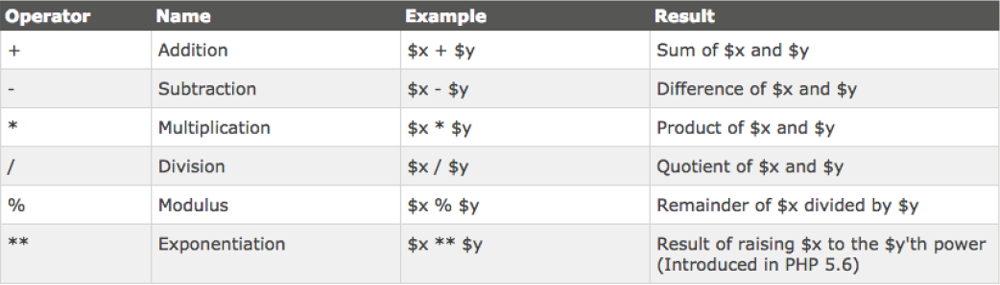
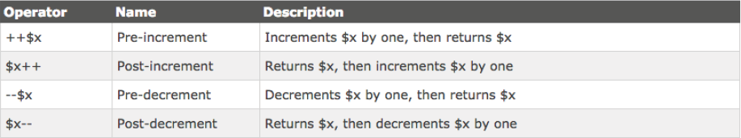
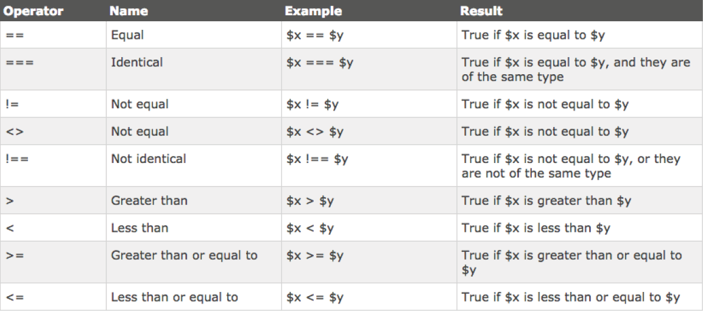
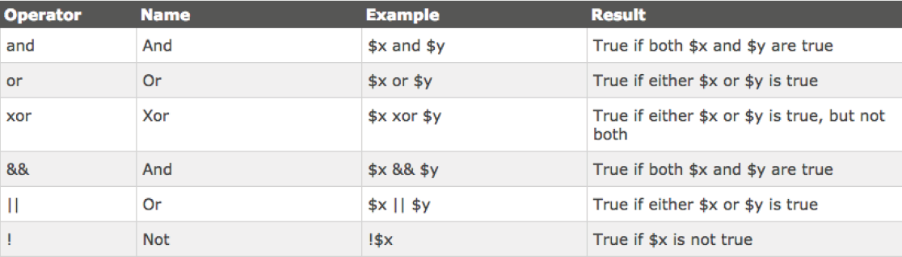

# Initial page

## INTRODUCTION

### 01. INTRODUCTION TO PHP

So, its time to get familiar with PHP. PHP is a dynamic server-side scripting language, many CMS’s like Wordpress make use of its functions and capabilities, so its about time you make use of it too. I’ll take you step by step through some of the basics as well as some of the features and functions that apply to Wordpress.

#### PHP stands for PHP Hypertext Preprocessor...um what? 

It sounds pretty stupid, but the first P in PHP stands for PHP...its actually a coding/ programmers/nerds gimmick. 

PHP is a free and open-source of language. Its paid alternative, ASP.NET you’ll also see knocking around the internet. PHP runs wordpress like we’ve discussed, but it also runs social networks like the almighty Facebook.

First of all, you need to understand one thing. PHP does not run in the browser...which means if you open up an index.php - all you’re going to get is the code your wrote spat out at you as you typed it. Markup and all.

You will need to run your index.php file through MAMP or upload it to a live server on the internet. Also, php syntax cannot live with in a .html file extension. Your index.html must now become a index.php if you want your PHP syntax to work.

PHP files can contain HTML, CSS and Javascript as well as PHP syntax of course. The code \(PHP\) is executed on the server, not the browser and code is generated from that execution and returned to the browser as HTML, CSS and sometimes Javascript.

#### So what can PHP do?

* Generate Dynamic Page content.
* Create, open, read, write, delete and close files on the server
* Collect and verify form data
* Interact with a Database like MySQL
* Page Restrictions like Login and Registration
* Encryption

So, lets write your first PHP function.

Copy the text below and save it in an index.php file.

```php
<!DOCTYPE html>
<html>
    <body>
    <?php echo “Hello, World”; ?>
    </body>
</html>
```

You’ll notice we still have an HTML 5 doctype declaration...Well, PHP is very similar to CSS or Javascript in the way that it communicates with the browser, so HTML is still at use here.

The echo function is commonly used for “printing” text to the screen. We’ll get into it in a bit though. Refresh your browser and take a look at the result. Simple text? Its not in a &lt;p&gt; tag though?

### 02. PHP SYNTAX

All PHP related code must be executed with in a PHP block.

We start a PHP block off as such:

`<?php`

Similar to an html tag, save for the question mark. and we end it with a:

`?>`

You must remember, with most scripting languages, that for every instruction you give the computer you must end it with a ; - just like we do in CSS.

Comments in PHP are written the same as in CSS for multiple lines, however you can comment single lines of code by using the :

`// This is a php comment for single lines`

`/* This is a php comment`

`for multiple lines of php syntax */`

Its also important to note that functions in PHP are not case sensitive unlike its cousin Javascript. you can write a function like:

**echo**

**or**

**ECHO**

**or**

**eCho**

**or**

**echO**

The only thing to remember is that PHP variables, when they are defined ARE case

sensitive, so:

**Red**

**and**

**red**

are two different variables as far as PHP is concerned.

### 03. VARIABLES

On a very basic level, variables “store” information.

Other than that, it means what its name implies - that it can store information that will always change. A simple example would be a volume slider on iTunes, the computer needs to perform a function based on information that has changed in volume based on user input - we don’t know what that variable value will always be, so hence the fact for declaring a variable? We can then run our code the same way with a more dynamic value.

**In PHP, we use the $ to declare a variable:**

`$z = 5`

The value 5 will be stored in the variable $z. You might find your algebra from school coming into play here.

**Lets consider the following:**

`$x = 5`

`$z = 2`

`$y = 3`

In PHP I could say $x &lt; $y

Essentially meaning - 5 is less than 3.

There are a few rules that govern variables: Like we’ve discussed, a variable must always start with a $ then the name you want to assign it.

* A variable can never start with a number or underscore.
* A variable can only accept alphanumeric characters and underscores.
* A variable is always considered to be case sensitive.

**Text vs Numbers**

While writing variables its important to know their meaning and how they are written:

**Text Value:**

`$name = “Daine”`

**Text Value Integer**

`$x = “5”`

**Integer**

`$y = 5`

You may be asking yourself what the difference between the “5” and the 5 is? Actual numbers don’t require double quotes, they are what they are, quantitative numbers. When we write “5” like this however, PHP does not consider it to be a number. PHP also has whats known as Variable Scope, there are 3 different types of scope:

`local`

`global`

`static`

This subject really has to do with more advanced PHP than you’re ready for just yet, so we’ll refer back to it when its necessary.


### 04. ECHO AND PRINT

We’ve already come across the echo function. Echo is a way of sending output to the

browser.

`<?php`

`echo “Hello!”`

`?>`

Will literally send the output Hello! to the browser. You can also output multiple “strings” anything in quotation marks are known as strings. Like so:

```php
<?php
echo “Hello!”;
echo “How are you?”;
?>
```

The print function only outputs 1 string at a time:

```php
<?php
print “Hello, there”;
?>
```

The one useful function of echo is that it can contain HTML...hopefully the puzzle pieces are clicking now:

```php
<?php
echo “<h2>Products</h2>”
?>
```

You can even echo out variables:

```php
<?php
$school = “Friends of Design”;
echo “You should study at $school”;
?>
```

You can decide whether or not to use echo or print - echo is more common and a lot faster. I tend to use echo, as the print function in Javascript will actually print anything in the “quotations” for you...

**PHP Strings and Integers**

Like you know by now, anything contained with in a “quotation” is considered to be a string. You can use single or double quotes. An integer refers to a number without any decimal points. It must contain at least one digit, so 2. It cannot contain any comma’s or blanks. It can’t have a decimal point. 

It can however be positive or negative.

PHP can also accept Booleans, a boolean is either true or false, and these values can be stored with in variables:

`$e = true;`

`$t = false;`

### 05. ARRAYS

A variable can only store one piece of information, but an Array can store multiple. We get into arrays with more detail later in this course.

The syntax for an array looks like this:

```php
<?php
    $cars = array(“BMW”, “Mercedes”, “Bently”);
?>
```

Arrays require a bit more functionality in order to be really useful, for now, just understand that we use an array to store lists or items of a particular category.

### 06. OBJECTS

There is such a concept in Computer Programming known as Object Orientated Programming. An object - to be really simple, is a “thing” that can perform a set of activities. These activities define the objects behaviour.

An example would be, lets say we have an object called “StudentMarks” we can write code with in that object to specify what courses they are taking and their average marks.

A “Student” object would maybe tell you the students name and address.

We will look more deeply into this in later modules.

Lastly, variables can also contain a special value, which is called NULL. Null, means nothing.

You can have a variable like:

`$x = null;`

### 07. STRING FUNCTIONS 08. CONSTANTS

Most scripting languages have a way to access and manipulate text that exist within strings. These are know as string functions.

We’ll go through a few of them here:

We can find out the length of a string by typing:

`<?php echo strlen(“Hello world!”); ?>`

PHP should return 12 - the space is counted as a character swell.

The next function will search for a specified character\(s\) with in a string:

`<?php echo strpos(“Hello world!”,”world”); ?>`

We first declare our string “Hello world!” and then use a comma to tell PHP what it is we are looking for, in this case “world”. Remember the white space is counted, so the browser will return 6.

### 08. Constants

Similar to a variable, PHP Constants cannot be changed.

It is simply an identifier for a certain value. Lets take a look at the example below:

```php
<?php
define(“HELLO”, “Welcome to Friends of Design”);
echo HELLO;
?>
```

Here we tell PHP to store “Welcome to Friends of Design” in “HELLO”. We use the define function to tell PHP to do so.

Consider the code below:

```php
<?php
define(“HELLO”, “Welcome to Friends of Design”, true);
echo hello;
?>
```

All constants take 3 parameters.

define\(“name”, “value”, true or false about case sensitivity\);

You can see that our “HELLO” name is written as “hello” in our echo - but because our case sensitivity is set to true - the function becomes case-insensitive.

### 09. OPERATORS

Most programming languages have a number of arithmetic operators. You should be familiar with most of them.



There are some more complicated ones, but these will suffice for now.

```php
<?php
$x=10; // declare variable x
$y=6; // declare variable y
echo ($x + $y); // outputs 16
?>
```

We also have string operators:

. for concatenation in other words:

`$txt1 = “Hello”`

`$txt2 = $txt1 . “ world!”`

`or`

`$x = “Hello”;`

`$x .=“ world!”;`

`echo $x;`

The .= will concatenate and the world! to Hello to create a full string.

It is also useful to Increment PHP values:



Heres an example:

`<?php`

`$x=10; echo ++$x; // outputs 11 ?>`

You find that using Comparison Operators are the easiest way to create well structured

logic:



In PHP we also have Logical Operators to play with:



### 10. CONDITIONAL STATEMENTS

Conditional Statements allow you to execute code or actions based on certain conditions.

In PHP we have:

**if statements -** will only execute code if a condition is true

**if / else statements -** executes some code if a condition is true and another code if the condition is false

**if...elseif....else statement -** selects one of several blocks of code to be executed switch statement - selects one of many blocks of code to be executed

if statement:

`if (condition) {`

`code to be executed if condition is true;`

`}`

Lets use an example:

```php
<?php
$time=date(“H”);
if ($t<”20”) {
echo “Have a good day!”;
}
?>
```

We create a time variable and store PHP’s function to get the date and narrow it down to Hours in its parameter.

In the if statement, we ask if the current time is less than “20” hours, echo out “Have a good day!”

If / Else Statements

`if (condition) {`

`code to be executed if condition is true;`

`} else {`

`code to be executed if condition is false;`

`}`

This statement holds two arguments. It asks if the condition in the if is true, if it is, it executes code. Then in the else, if the statement is false, it executes another bit of code.

```php
<?php
$t=date(“H”);
if ($t<”20”) {
echo “Have a good day!”;
} else {
echo “Have a good night!”;
}
?>
```

If / else if else Statement

You can use the statement if you need to apply a number of code blocks to be executed: 

`if (condition) {`

`code to be executed if condition is true;`

`} elseif (condition) {`

`code to be executed if condition is true;`

`} else {`

`code to be executed if condition is false;`

`}`

The example below will execute “Have a good morning” if the current time is less than 10AM, “Have a good day” if the current time is less than 20PM or otherwise, will echo out “Have a good night!”

```php
<?php
$t=date(“H”);
if ($t<”10”) {
echo “Have a good morning!”;
} elseif ($t<”20”) {
echo “Have a good day!”;
} else {
echo “Have a good night!”;
}
?>
```

### 11. WHILE LOOPS 12. PHP FUNCTIONS

In relation to Wordpress, the While Loop is a very important part! In order to constantly update posts, Wordpress uses a while loop to cycle through the posts in the database as news are added. Lets look at basic While Loop syntax:

`while (condition is true) {`

`code to be executed;`

`}`

They are very similar to if/else statements, save for the fact that this particular Loop will only cycle through a given block of code if a condition is true. For instance, if there are posts in the database, cycle through them.

```php
<?php
$x=1;
while($x<=5) {
echo “The number is: $x <br>”;
$x++;
}
?>
```

In this piece of code, the following happens:

1.  We set a variable “x” equal to 
2. We ask PHP if “1” is less than or equal to 5”
3. If that is true, then we echo out “The number is $x” and increment it by one.
4. The while loop will constantly spit out feedback as long as the condition is true.

### 12. PHP FUNCTIONS

We’ll come across functions very often while building Wordpress content, so its good to understand what a function is in its bare form: A function is a block of statements that can be repeatedly used in a program. It wont run as the page loads, but only when we call to the function to run. A function name cannot start with a number. Only a letter or underscore. Most importantly, you should name the function as by what its purpose is.

`function functionName(){`

`code to be executed;`

`}`

You need to use the keyword “function” to tell PHP you are indeed creating a function, then the name, and similar to CSS, the code to be executed in {} brackets. Lets test one out:

```php
<?php
function HelloWorld() {
echo “Hello world!”;
}
HelloWorld(); // call the function
?>
```

As you would have guessed, this function will simply output “Hello, world!” on to the screen. PHP functions can also contain what are known as arguments, these arguments exist between the parenthesis of the function name:

```php
<?php
function familyName($fname,$year) {
echo “$fname Mawer. Born in $year <br>”;
}
familyName(“Daine”,”1989”);
familyName(“Byron”,”1992”);
familyName(“Clive”,”1950”);
?>
```

The function below has two arguments. You can think of arguments, similar to variables. Theres 3 things you need to be aware of here. We create a function called familyName and pass 2 arguments through it:

`1. $fname`

`2. %year`

The code to be executed is “$fname Mawer. Born in $year”

Once we’ve closed our curly brackets, we call the function as many times as needed, but based on information that we input.

The code will run, and echo out something like this:

**Daine Mawer. Born in 1989**

**Byron Mawer. Born in 1992**

**Clive Mawer. Born in 1950**

We could also add another argument to specify the relationship.

Add $relationship to the argument in the function, separately by a comma, and then the input in the call to the functions:

```php
<?php
function familyName($fname,$relationship,$year) {
echo “$fname Mawer. Relationship: $relationship Born in
$year <br>”;
}
familyName(“Daine”,”Son”,”1989”);
familyName(“Byron”,”Brother”,”1992”);
familyName(“Clive”,”Father”,”1950”);
?>
```


### 13. PHP ARRAYS

The last topic in this Introduction to PHP is Arrays:

An array can store multiple values inside of a variable. You can think of an array as a special kind of variable which can hold more than just one value. They are usually used for lists of items. Lets consider that we would like to make a healthy juice. Every juice we make can only have 3 fruits. If we were to store each fruit in a variable, it would look like this:

```php
<?php
$fruit1 = “apple”
$fruit2 = “carrot”
$fruit3 = “ginger”
?>
```

Hmm, possible, but not so practical if you had 300 fruits to choose from! With arrays, we can just create a name, so $fruits and then store as many values as we like inside of it:

`$fruits=array(“Apple”,”Carrot”,”Ginger”);`

`echo “I need “ . $fruits[1] . “, “ . $fruits[2] . “ and “ .`

`$fruits[3] . “ for my juice.”;`

**This code will output:**

I need Apple, Carrot and Ginger for my juice.

There a 3 different types of arrays that can be used with PHP, we wont go through all of them, but the most commonly used array in Wordpress is an Associative Array:

These basically have a property/value relationship. Lets say we wanted an array of fruits that had a property of fruit and the value was their respective calorie count:

`$fruits=array(“Apple”=>”135”,”Carrot”=>”300”,”Ginger”=>”43”);`

`echo “Apples have “ . $fruits[‘Apple’] . “ calories.”;`

The above echo will output:

Apples have 135 calories.

### 14. WHAT ELSE CAN PHP DO 

PHP can also be used to handle form data. Up until now, we have been mainly concerned with structuring and styling HTML forms, but we need a way to get the inputted information from the user and do something with it.

**There are mainly two methods used:**

* **GET**
* **POST**

PHP can also validate form data. If you’ve ever seen form fields go red or display a “require” - its validation. You can validate emails and names and other things. PHP can also connect to databases. This is important as we need to sometimes communicate with databases to store information or retrieve information stored in the database already. PHP can select, delete, insert and create in a given database.

We can even read files with PHP, or even more, create files on the server. You can create uploads too.

One very useful part of PHP is its ability to stitch all of these capabilities together to create complex systems like user registration, login sessions or show content to only registered users.

PHP also integrates smoothly with AJAX - Asynchronous Javascript and XML, which allows you to update parts of a website behind the scenes without refreshing the page. Just about every social media platform we have uses AJAX in its web pages.

Lastly, PHP can also send email! Yes, thats right. It has a built in function called mail\(\).

### 15. ADDING HTML WITH PHP


Just like you can echo out plain text in PHP, you might get to the point where you want to dynamically add HTML with a CSS class in order to style its output on the Front-End. This can be done in one of two ways:

Heres a few examples:

`<?php if(5 === 5){ ?>`

`<p class=“lead”>Duh!</p>`

`<?php } ?>`

Note here that the PHP tags are self contained - the PHP parts are PHP, the HTML is HTML and the closing PHP “}” is PHP. Read it carefully.

`<?php if(condition){`

`echo “<input type=\”text\”>”;`

`} ?>`

Here you might notice that we have “ in “ we will need to programmatically escape these by adding a “\” where a “ appears inside of a “”.

Alternatively:

`if(condition){`

`echo ‘<input type=”text”>’;`

`}`

Use **‘** quotes for your echo and place **“ ”** inside.

### 16. EXERCISES

1. Create a PHP variable and echo it
2. Create a PHP Function that defines a variable and echo’s it
3. Create a conditional statement that echos out “Thats Right” if the statement is true
4. Create an Array and echo out the 3rd item.

## MODULE 1 – Introduction to Wordpress

01. What is a CMS

02. Alternative CMS’s

03. Why Use Wordpress

04. Web Technologies

05. Wordpress in Industry

06. Resources

07. Exercises


### 01. WHAT IS A CMS

Welcome to Wordpress Essentials. My name is Daine; Im the supervisor for all things web here at Friends of Design, and I will be guiding you through - for some of you - will be your first encounter with Wordpress. Wordpress is a CMS or Content Management System that allows your to create incredibly dynamic blogs and websites with ease. Note; that you will be learning a new language in this course which goes by the name of PHP.

Dont be frightened, it sounds scary, but it actually isnt.

If you have any questions during the duration of the course, please feel free to email me at daine@friendsofdesign.net. Lets get started...

**Heres a wiki for CMS:**

A content management system \(CMS\)is a computer program that allows publishing, editing and modifying content as well as maintenance from a central interface. Such systems of content management provide procedures to manage workflow in a collaborative environment. These procedures can be manual steps or an automated cascade. CMSs have been available since the late 1990s.

CMSs are often used to run websites containing blogs, news, and shopping. Many corporate and marketing websites use CMSs. CMSs typically aim to avoid the need for hand coding but may support it for specific elements or entire pages.

More importantly: A web content management system \(web CMS\) is a bundled or stand-alone application to create, manage, store and deploy content on Web pages. Web content includes text and embedded graphics, photos, video, audio, and code \(e.g., for applications\) that displays content or interacts with the user.

A web CMS may catalog and index content, select or assemble content at runtime, or deliver content to specific visitors in a requested way, such as other languages. Web CMSs usually allow client control over HTML-based content, files, documents, and web hosting plans based on the system depth and the niche it serves.

As you can see from the abobe definitions, CMS’s are there to help us manage content without us having to hard-code client side languages all day long. They basically make our lives a lot easier. 

In context to Wordpress, the CMS has grown so much that managing blog posts is one of its very basic operations: ecommerce, forums, restaurant bookings, courses and lessons, the list is virtually endless. If you have the right plugins and themes you can make wordpress do just about anything for you - and when I say “do” I mean, manage.

### 02. ALTERNATIVE CMS

Wordpress is a popular CMS for many reasons like we’ve discussed, but that doesnt mean its the only one. Each CMS has its own strengths and weaknesses. One thing developers find incredibly frustrating with Wordpress is its link management, having to constantly add PHP functions to create dynamic links.

**Examples of other open-source CMS are:**

* Drupal \(www.drupal.org\)
* Joomla \(www.joomla.org\)
* Magento \(www.magento.com\)

These sites, save for Magento which is a ecommerce CMS, have been around for a while and many developers still use them. You can visit the links below and compare dashboards. The point is, that a lot of these CMS work on the same principles and concepts that Wordpress does, they’ve just gone about it in a different way, maybe using differnt languages Ruby instead of PHP for example. There is no better or king CMS out there - it really boils down to how comfortable you are in your skill and what you need to accomplish.

### 03. WHY USE WORDPRESS

In terms of userbility, customization, support, popularity and its level of dynamic ability - Wordpress seems to trump all CMS’s with relative ease. Websites like Themeforest supply thousands of professionally coded Wordpess Themes which are so powerful that its not very often that you need to write code.

Like we’ve discussed before - Wordpress has so much support for beginners as well as advanced users. They’ve even gone as far as to invite anyone who thinks they are up to it to contribute to the Wordpress Codex \(you will hear the word “codex” come up a lot, its a fancy name for core\) if you put in the time and effort to understanding this CMS it will yield you amazing results.

It takes time though, it is so dynamic that literally anything you could think of creating can be made in reality if you understand the languages at work.

### 04. WEB TECHNOLOGIES

Wordpress works on a 5 main langauges. These languages are split up into to categories:

1. Server
2. Frontend

**Frontend**

As a striving web designer you should all know HTML and CSS - the building blocks for any website that is read by a modern day browser. If you were really cutting edge you might understand a bit of javascript or jQuery too, simply for interactivty reasons - but now with the advent of CSS3 some jQuery has become redundant. Its very important to understand how these languages integrate with each other. A thorough understanding of HTML and CSS is required to complete this course. We wont be using Javascript, but an understanding is always helpful as you will see similiarties in its syntax when we tackle PHP.

**Server**

PHP runs on the server - its not a frontend langauge. You cant see it in the browser and it will never show you exactly what its doing. The entire Wordpress CMS is bult using PHP. When we speak about PHP we refer to it as a server-side langauge. Its the messenger boy that carries out functions and stores information in variables. You can think of it like the glue of Wordpress. Its a very strict and fragile language, meaning if you leave out a semi-colon somewhere, you work is going to dissapear.

PHP is also very fond of MySQL - which isnt a language in itself but it uses what is called SQL queries. MySQL is effectively a database software that talks to the front end of websites using PHP. PHP integrates seamlessly with HTML, allowing you, as the user to embed specific PHP code that communicates with the database via the Wordpress core. This will all become a lot easier to understand when we’ve taken a deeper look at it all.

This course spans over 4 weeks. I urge every single one of you to put in time over weekends or during the day if your lifestyle allows for it, to touch up on any HTML and CSS, and if you’re brave enough, jump onto webistes like CodeAcademy and give the PHP

Essentials course a go, it will dramatically help you through this course.


### 05. WORDPRESS IN INDUSTRY

Wordpress started off as an open source blogging tool. In fact, it is still an open source blogging tool. We’re currently on version 3.9 of Wordpress - 3.8 being a major release of UI, operations and functionality. Wordpress is owned by Automatttic. The company was started by a gentleman named Matt Mullenweg.

So, Why is Wordpress so popular? Well, theres a number of reasons. First of all, its free! Yup, no cash required to download the install files. They’re free and always available on wordpress.org. Wordpress is also very dynamic, its very light-weight and runs on opensource, community driven languages like HTML, CSS, MySQL and PHP.

There is a gigantic community of web developers and designers who are Wordpress. Plenty of websites, blogs and forums like Stack Exchange offer support for new users of Wordpress, as well as Automattic themselves with there integrated community tab on their website. Wordpress also comes in two flavours: wordpress.org \(which we’ll be using\) and wordpress.com - Now, we wont be going near wordpress.com in this course, not because its bad or unwarranted, but because theres no way of customizing it to our needs. It doesnt provide any access to core files, or theme customization.

What you really have is a Tumblr or Blogger on your hands, and that is great for the individuals who couldnt care less about code. Wordpress is so popular that they host yearly meetings called Wordcamps - we had one in Cape Town last year.

**Here’s some cool stats:**

1. As of March 2012 there are currently 72.4 million websites using Wordpress as their CMS of choice.
2. There has been 98 releases of the Wordpress core to date.
3. Top Companies using Wordpress? BBC, Top Gear, National Geographic, CNN, New York Times, NFL, HONDA.
4. It is the most popular CMS on the planet, beating Drupal and Joomla.
5. Wordpress.com is the 18th most popular blogging tool in the UK.
6. 22 of every 100 new domains in the US are running Wordpress.
7. In Indonesia - Wordpress.com is the 8th most popular website
8. There are 37 Million Wordpress related searches every Month.
9. In the first week of March 2012 - 826,000 Youtube videos were embedded into Wordpress sites.
10. Wordpress is natively integrated with: Facebook, Twitter, Soundcloud, Google Maps and Vimeo.
11. Currently - Wordpress owns 53.8% of the CMS Market

* Joomla 9.2%
* Drupal 6.2%
* Others 30.3%

Theres two main ways to implement wordpress.

1. Theme Development
2. Customizing pre-bought themes.

The second version is most common in developing markets. Although it is common knowledge that people do this with hardly any web design skills, you can only go so far.

**Theme Development**

This is the hardcore, coding intensive, team-requiring effort of very experience web designers and developers. Its one thing creating a personal blog - as Wordpress natively supports such functions and callbacks - however, when you see wordpress templates that move away from blogs and become actual dynamic websites with portfolios, effects, animations etc, they has deviated away from the “core-purpose” of Wordpress, manipulating its open source frame work to satisfy their needs. Its quite genius if you think about it, but it requires many many years of experience to create something that intricate and dynamic.

Clients will also pay thousands of rands to have their own website moved across to Wordpress, maybe they had implemented a static HTML/CSS/Javascript site previous, or maybe they were running on Joomla,because these CMS all use databases and server-side script, an experienced web developer can make the transition with relative ease.

**Customization**

This is a particular gap in the Wordpress market, theme authors, like those on Themeforest design themes for users that they can pay and download and then use on their particular client site. Lets take an example, you get a freelance client asking for a website for their restaurant. After assertaining what the client wants - menu, reservations, background slider, you can jump on to Themeforest and use the keyword “restaurant” to find all Wordpress themes tagged with “restaurant” You can then narrow down options that contain all of the above requirements, a little bit of customization, colour and font changes and alignment with the brand identity and you can sometimes get what is a completely different looking theme.

Clients are happy as it looks professional \(depending on your skill of course\) and they pay you a very nice sum of money as they can manage the website themselves using Wordpress’ simple Dashboard.

That being said, there is a standard good practice for theme customisation which we will go through in the 3rd week of this course.

### 06. RESOURCES

I am continually adding resources to my Delicious page online if you guys would like to access some of the resources I have there. I will populate it during the course as I take you to each site and show you what will help and what wont.

Your biggest and baddest friend will always be the Wordpress Codex [codex.wordpress.org](http://codex.wordpress.org)

Its more of a dictionary than a walkthrough guide, but you will start to understand it a bit better as we go along.

### 07. EXERCISES

1. Research the available CMS on the internet, and also try and discover any new CMS that are up and coming and may be useful to you in the future.

## MODULE 2 – Installing Wordpress

01. Setting up a Local Server with MAMP

02. Create a MySQL Database with phpMyAdmin

03. Understanding Databases

04. How PHP, MySQL and MAMP work together

05. Setting up a Wordpress Installation on a Live Server

06. Installation Run

07. Exercises

### 01. SETTING UP A LOCAL SERVER WITH MAMP

Wordpress is essentially just a file structure of server specific files. You can download it from wordpress.org. Once the download is finished you will see a wordpress-3-9.zip file on your hard drive, double click that to unzip and a folder will be extracted, within this folder are the wordpress core files.

**There are 3 ways to install Wordpress:**

1. Famous 5 minute install
2. Using cPanel on a live server.

We will go through these installations in training, in the notes further things need to be explained before we continue with installation, namely MAMP, MySQL and phpMyAdmin. A local server is essentially a live web server that uses your computers ip address to show websites that you build. No one can access it but you, its not a live website and it will only run when a particular program is running in the background. This program is known as MAMP. MAMP stands for:

Macintosh, Apache, MySQL, PHP. Its a stack of programs that integrate with each other to provide you with everything you need to run a virtual web server. Macintosh is your OS Platform, as you might have guessed there is a WAMP \(Windows\) and even XAMP \(pronounced ZAMP\) for Linux or Windows, or Mac. 

Apache is a type of web server. Most web servers use apache. MySQL is your database facility PHP is the server-side script that communicates with the server \(Apache\) and the database \(MySQL\) MAMP combines all these technologies into a nice user-interface for you, otherwise you’d be using the Terminal or DOS to write commands which is a language itself. You can download MAMP from www.mamp.org

It is installed on the computers, so open it up. We might have to set some preferences on first launch. Click on Ports and set Apache to 80 and MySQL to 3306. Doing this, will allow you to access your Wordpress site at the following URL http://localhost or http://localhost:8888

Next you will want to specify a folder on your computer where all the files for your site will live, click on the Apache tab and hit “Select” to open your HDD browser. I normally add this folder to Documents, so its out of the way. If you move the files from this folder, or the folder out of its default location, your site will break.

Make sure that before you save through - that your Apache and MySQL servers are both running, indicated by a “green” light - if one is red, then there is a problem with the port numbers or the network that you are connected to is blocking that particular port for security reasons.


### 02. CREATE A MYSQL DATABASE WITH PHPMYADMIN

Its now time to create a database through a program which is launched from MAMP known as phpMyAdmin. Its a simple program that runs in your web browser, and gives you control over database functions.

In MAMP click the Open Start page button - this will take you to the default MAMP welcome screen. The tabs in the top will indicate some software that is currently available for you to run

What you get next might scare you a little, but its nothing to be afraid of, click on the database tab and then type in a name for your database - call it “yourname\_db” make sure you remember it, EXACTLY how you have written it. Keep it safe somewhere, as you will need it again soon. Right now, thats all you need to get things going in terms of a database.

### 03. UNDERSTANDING DATABASES

You’ve all used Excel before...well - that is essentially a databse. A MySQL database uses tables and headings to structure information. Each cell has certain information stored with in it. In Wordpress’ case, it uses these tables and headings and structure to store information, links, media, posts, pages and settings in a central...well, database, that it can quickly access when you request it from the front end.

We will briefly go through some of the tables involved in the Wordpress installation, but its not recommended to go play around with in the database. It runs very strict protocols and can be easily broken.

Certain actions like deleting the database or exporting/importing database tables can be performed using the graphical interface, or with SQL queries, which is a language in itself that is beyond the scope of this course.

For now, understand that everything you do in Wordpress will be stored in a database table.

### 04. HOW PHP, MYSQL AND MAMP WORK TOGETHER

PHP and MySQL are part of what is known as the MAMP stack \(Macintosh, Apache, MySQL, PHP\) all these softwares are installed on your computer during installation of MAMP.

You can think of MAMP as the train tracks for a process that happens. PHP is the train, and MySQL is the important destination. PHP talks to MySQL, pulling information from the database and sending it to the server, or the browser - whatever the client can see.

Of course on our end, we see HTML and CSS - PHP is such a dynamic language that it can talk to MySQL, bring up information and then easily live along HTML and output dynamically generated HTML from queries that it makes to the database - for instance, the name of your blog.

This process is fundamental to understand - see the diagram below:

### 05. INSTALLING WORDPRESS ON LIVE SERVERS

When it comes time to setup a Wordpress installation on a live server, such as www.example.com, things are a little different. Most cPanel installations have what are known as scripts that do a lot of the hardwork for you.

MySQL is native on cPanel, meaning there is a easy wizard that will take you through the process of setting up a database, database user and password - in MAMP - your username and password is either automatically specified by the MySQL installation - normally

`UN: root`

`PW: root`

**You can change your password.**

When it comes to installing Wordpress on cPanel, a software known as Softculous manages the installation of the database and the Wordpress Core - you fill out a few settings and options and it handles it for you with out you touching any code, of course you can choose to do this manually as well. We will run this process in class to demonstrate.


### 06. INSTALLATION RUN

Lets run an installation of Wordpress. First we will do the easy way - the Famous 5 Minute Install. We’ll pick up where we left off. We’ve created a database, but now we need to get Wordpress connected! Copy the files from within the Wordpress folder you downloaded, and paste them into the folder you create as the destination for your site, or your site-folder.

Make sure MAMP is still running. Direct your browser to [http://localhost](http://localhost) or [http://**localhost:80**](http://localhost:80) **or** [**http://localhost:8888**](http://localhost:8888)

Make sure that if you want to run multiple versions of wordpress off your server, you addthese files into folders with in your site folder - for instance if you copied your files into a folder named - “installationone” then you would need to point your browser to

[http://localhost:8888/installationone](http://localhost:8888/installationone)

_If all is in order, you’ll get this_

??? Missing

This is a good sign, dont worry. You will become very familiar with this wp-config file after a short while. For this installation, you dont need to touch it.

Hit the “**Create a Configuration File**”

_Awesome, you’ll be confronted with this:_

Remember your database name? _yourname\_db_ 

Your username will be root - its the default for any MySQL installation

Your password will be root if you havent changed it in MAMP

Database Host is localhost.

The table prefix can be changed to any 3 character string -

I normally choose the first letters of my name - so dm\_

This is not necessary, but its an extra measure of security incase your website gets hacked.

Click “Submit” when you are done, if everything goes well. Then you should get the following screen:

This screen asks you for a Site Title - which you should fill in

**Username:** Whatever you like

**Password:**  Make it strong

Add your email address

The privacy option lets Google index your site - maybe not such a good idea if you’re still building it! When you’re happy - hit “Install Wordpress”

If all went well - you’ll get the screen above allowing you to log in to your site. If you got this far without any problems, you’re a genius! Well done!

### 07. EXERCISES

1. Setup MAMP and download a version of Wordpress, create a MySQL database using phpMyAdmin, then install Wordpress and open up the Dashboard.

## MODULE 3 – The Wordpress Interface

01. The Dashboard

02. Posts

03. Media Library

04. Pages

05. Comments

06. Appearance

07. Plugins

08. Users

09. Tools

10. Settings

11. Exercises

### 01. THE DASHBOARD

So, we’ve successfully installed Wordpress, your database is connected, username and password is set, and now its time to get familiar with the Wordpress Dashboard. The Dashbaord is the main landing page for any Wordpress installation, and provides you with all of the links to get to the places you tneed to, in order to build and customize your website.

1. The Widgets

2. Sidebar

3. Admin Bar

Lets start with the Widgets. These widgets exist to provide you overall information about your site, some news from Wordpress’ blog as well as some quick editing features that you can publish posts from, the widgets can be easily re-ordered and the “Welcome” banner can be closed. If you know about the Wordpress codex, then you can jump into the functions.php file and hide some of these widgets, unfortunately there is no way of customizing them without using PHP. You will find that some plugins, like Google Analytics for instance will install their own widget on the dashboard. You can also collapse widgets so that they dont take up as much space as their default. I’ve found that I dont use this area all too often.

Next is the sidebar. This houses all the special functions and abilities contained with in Wordpress. We’ll go through them one by one in the next few sections. It should be known, that Wordpress was built for simplicity and power, each post-type, like pages or posts, portfolio or sliders are what are know as custom post types, and they all work off the same 3 tier principle: “All Posts“, “Add New”, “Categories” - you will find these options on all post types - some more customized, some not. The admin bar, which can be turned on and off on the client side of your site, helps with quick tasks, like comments and and post creation, some plugins like Jetpack also use this admin bar for settings and tracking. Its helpful to have turned on especially when you are setting up your website for easy access back to your dashboard. Lets go through each tab individually now as to get you more familiar with how Wordpress works.

### 02. POSTS

The posts tab houses your blog. Each Wordpress installation comes default with posts and you will see just how it fits together in a few lessons time. By clicking on Posts you will be sent to the posts directory.

Here you will see all posts created, deleted and published. You will also see important meta-data like title, author, categories, tags, comments and the time of publishing.

To create a new post - click the Add New link \(theres two\) and you will be redirected to a WSYWIG editor for post creation.

Here you can create new posts, as if writing in a normal text-editor, or you can write in structured HTML by switching between the Visual, and Text tabs. You can select Categories and Featured Images \(which is thumbnail image users can associate your blogpost with\) as well as Publish your posts.

You can also schedule posts and save them in Draft mode, which will save any work you’ve done without publishing it to the front of your site. We could easily spend an entire lesson on this, but I will keep it short as we have alot to ge through. Make sure you follow along in the examples in class.

### 03. MEDIA

The Media library is Wordpress’ directory for housing all your pictures associated with your blog, whether its photographs, logos, portfolio items or social media icons, it can be quite useful for custom development. The media library works by creating a folder in your default Wordpress installation within a folder called “wp-content”. Everytime you upload media, Wordpress archives the upload by year and month, which can be quite helpful. The Media Library has a different view when accessing it from the Dashboard, compared to using it from with in a post, see below:

As you can see, the two versions are very diferent. Wordpress also natively supports the creation of galleries, enabling the user to select images they have uploaded, and Wordpress doe sthe rest, rather than installing a 3rd party plugin.

### 04. PAGES

Pages are used to input custom content or even static content where you see fit, in a traditional blog or website you’d create a contact page or an about us page - the content is always the same unless you have some specific functionality. The Page view brings up the same editor as the Posts view does with one or two differences.

As may see, in the Page Attributes box, the page can be set with a specific template - you will learn more about this in the 2nd part of this course, but they are normally templates like Contact, Full-Width or Homepage. This is coded up in the development process and set by the theme developer, for you conveinience more than anything else.

### 05. COMMENTS

The Wordpress comment system unfortunately leaves a lot to be desired, although powerful, it is very seceptible to spam and bots posting irrelevant and advertorial comments on your posts, its for these reasons that reCaptcha \(the form that forces your to decipher letters or numbers\) was created so that only humans could post comments.

Wordpress doesnt support reCaptcha natively, but there is a plugin for it. The plugin Akismet - is Wordpress’ default plugin for comment spam. Nevertheless, the owner or administrator of the website has full control over commenting, you are notified when comments are made, and if you find them hurtful or slanderous, you can chose not to even show them on the blog and ban the individuals IP address for good. Be careful of clicking on spammed links and they can sometimes be phising strategies to capture your information.

Its always considered good practice to management your comments correctly, dont have 5000 pending comments outstanding as it sits in your database taking up space and slowing down your Wordpress installation.

### 06. APPEARENCE

With in the appearence tab are a few important sub-sections:

Themes are the first section. Here you can upload themes, and even search for themesthrough the Wordpress Theme depositary \(an online sources of all themes uploaded to the Wordpress.org website\) In the screen shot above, you can see which themes I have uploaded on my installation of Wordpress.

We will be coming back to the section many times in the next few weeks, so im not going to go into too much detail about it right now. If you’ve installed a theme that has the “Customize” function enabled you will see a Customize tab visible under appearence. When theme authors create themes, they normally provide 1 or 2 options to customize the theme without you needing to change code. That will either be “Customize” or “Theme Options” if they think their theme options are more poweful than the customize tab then they will leave customize out completey. When you click customize you will get a sidebar alongside the main view of your homepage.

This bar, almost always contains specific Wordpress native customizations, like which menu to use, what name to give your website and whether you would like the homepage of your website to be a static page or your latest posts. It will differ from theme to theme. This is the theme options view that come with the installed theme I have activated.

Again, this will differ for every theme you install. Powerful themes normally have this option and it takes a very skilled Wordpress developer to produce something in this regard.

**Widgets**

Widgets are another very customized addition to your currently installed theme. Some theme developers create their own widgets that provide specific functionality to their theme. Wordpress is comes packaged with its own widgets, theres quite a long list, but they are mainly blogging focused, like - Recent Posts, Recent Comments etc.

Widgets only work in areas of your theme that have been registered to support widgets - this normally includes the sidebar and header of your theme, but can also include your header.

**Menus**

Menus contain a list of all pages and categories on your site, and let you organize them into a concise navigational menu for users to navigate around your site in a traditional fashion.

Adding to pages and categories, you can also link out of your website using custom links - say to “www.google.com” Here you can add a meta-description - describing what you’re page is about. You can also add keywords that Google will match with keywords typed into the search bar so that people can find your site.

To order menus - you can just click and drag to re-arrange. You can create as many menus as you like, but theme authors sometimes only make 1 or two places with in the theme available for menus to go - normally the top of your website and the bottom, you can choose what menus you want to go where in the “Manage Locations” tab at the top of the Menus page.

**Editor**

The editor contains a list of all theme files that are available for the current theme, Im not going to go into too much detail about it now, as you will become incredibly familiar with this section later in the course. The Editor provides access to the code of each document that makes up your theme, allowing you to customize code as you please. It can be useful but very dangerous at the same time. One file you will consider editing in this section is the functions.php file for instance.

A sitemap is a simple file that contains a breakdown of all the pages on your website. Google likes these files as it can quickly tell how big your site is, as well as what the site is about to a degree. Always make sure you include it for better SEO.

### 07. PLUGINS

Plugins are ususally 3rd party files that extend the functionality of Wordpress, they have been written with Wordpress in mind of course, however some are not written with CSS that will work with your theme.

Certain plugins can course problems and sometimes even break your theme, and there are certain rules that you should follow in order to keep your site safe in the long run especially when choosing plugins to install. We will go through plugins in more detail later in the course, but for now, just know that they exist and they can add some amazing functionality to your site. You might have noticed that plugins also come with an Editor allowing you to customize the code with in them, this is an advanced feature for developers and can include files like PHP, Javascript, JSON and CSS.

### 08. USERS

Wordpress natively allows the registration of users on your blog - if you allow it. If you want interaction and for people to comment and follow your blog, this is what you need to do, that being said Administrator profiles, \(with the most privledges\) can manage all users as they see fit. If you are a author or have some form of content generation on your site you can customize your profile which includes your public name, image, social media links etc. With the new release of wordpress you can even customize your back end colour scheme. We will go through all the options in class, but know that certain parts will and wont show up on your site depending on the themes author and what the purpose of the theme is.

### 09. TOOLS

The Tools section gives you some options for miscellaneous wordpress functions. “Press This” is a bookmarklet that lets you clip content from the web and add it immediatly to your blog. There is also an Import and Export function which will allow you to export content from your site and import content into your site from other blogs like Tumblr or Blogger or even another Wordpress blog - you’ll use the Import function quite regularly if you are downloading other theme authors themes in order to replicate content, pages, pictures and posts on your own installation of Wordpress. More on that later though.

### 10. SETTINGS

Settings has a number of important options.

Il go through them individually here:

**General**

General settings include things like Site Title, address, User roles, admin details and time format, I will go through them in detail in class, but sometimes you might find the answers to your problems here. Writing settings lets you set defaults that are concerned with publishing content to your site, I will go through the settings in class individually, but some interesting sections here are the Post via Email settings where you can send an email to Wordpress with your post content. This mail can be routed through your own personal domain which means you can update your blog from anywhere.

**Reading**

You will find yourself navigating to this page alot in your Wordpress career. Most themes require you to set a specific static page for your home page. This can be set in the “Front Page displays” section, you can also changes settings for your blog page as well as your Search Engine Visibility - if it is ticked, then search engines like Google will not index your site - of course that doesnt matter if you’re on a local server, but if you arent getting Google results on your website, check if you have this box checked or not.

Discussion has a number of settings that are related to comments and interaction on your website. Its not possible to go through all of them here, but I wil make mention of them in class. One special section to point out is the Comment Moderation section which allows you to ban comments when users use certain profamities or slanderous langauge. You can even block people off of your website.

**Media** 

The Media settings sets defaults for Media sizing and uploading. Dont mess around with these settings unless you know what you’re doing as it might yield some unexpected results on the front-end of your website.

**Permalinks**

Permalinks are how your links appear in the URL bar of your browser. You can set your own structure or you can choose from one of the defaults. If for instance you wanted to get your “About” Page to read http://www.example.com/about you would need to set your Permalinks structure to “Post Name” - we will go through the different options in class.

### 11. EXERCISES

1. Familiarize yourself with the Dashboard. Change settings, apply a new theme, download and active plugins and see their effect.

## MODULE 4 – How Wordpress Themes Work

01. What are Wordpress Themes

02. Theme File Structure

03. Required Theme Files

04. Downloading and Installing Themes

05. Exercises

### 01. WHAT ARE WORDPRESS THEMES

Themes in Wordpress is a multi-million dollar industry at the moment, they have gone far beyond just “skinning” the Wordpress installation and now actually provide some serious functionality. Major websites like Envato have created an entire sub website dedicated to buying themes for your particular need. Everything from restaurant themes, to photography/portfolio, app-showcase and online learning platforms exist with in theme functionality now and thats just the tip of the ice-berg.

When its comes to using Wordpress.org - naturally web designers wanted to start moving their static HTML and CSS designs to Wordpress, enabling their clients or themsleves to be able to update content with ease and efficiency. What is commonly termed as Wordpress Theme Development is a very deep rabbit hole indeed.

Whether its a personal blog or a theme that adds some very custom funtionality like portfolios, sliders and classifieds, web designers have to make the transition to web developer, essentially learning to program, create conditional statements, and understand the logic of a computers brain.

This might seem challenging, but like anything it just takes a bit of getting used to. Like we’ve discussed before - a frontend designer/developer will use HTML, CSS and Javascript as those languages are used by the browser. A good understanding of these langauges will only get you halfway however. As Wordpress is open-source, naturally one of the best langauges to choose for server-side interaction from the browser to a database is PHP. Thus, all of our special functions and practicality use PHP to speak to server and the database.

By the end of this course, you will have put together your own personal blog and have an understanding of how static HTML and CSS can integrate with PHP to provide some very dynamic functionality.

### 02. THEME FILE STRUCTURE

As you can see above, the theme structure looks incredibly complicated. However, in saying that it is a very complicated theme.

According to the Wordpress Codex, for Wordpress to be classified as a theme, it only needs 2 important files:

1. Index.php 
2. style.css

### 03. REQUIRED THEME FILES

Yup...that simple. But, thats not going to give you much of a theme. You might be surprised to find out, and its not known exactly why - but the style.css actually holds alot of the information about your theme, like name, author and some other needed info.

Ideally - your theme strucutre should look like this:

* index.php - similiar to index.html - this file is used as a default of you dont have a page.php, it also contains “The Loop”
* header.php - You guessed it, your header information and your opening &lt;HTML&gt; tag goes here
* footer.php - You want a cookie for getting this one by yourself? Any footer information and &lt;/HTML&gt; goes here. 
* page.php - used as a template for a static page template.
* single.php - used for a single blog post
* search.php - used to deliver search results when a user performs a search on your site.
* sidebar.php - If you have registered widgets for your sidebar...they go here.
* style.css - Theme meta-data as well as base CSS styles for your site.
* screenshot.png - used as a preview for your theme when activating/installing.

With that file structure you would be able to create a reasonably dynamic theme. Ive broken down above what each file does, then view the image below to understand what it is that Wordpress is actually doing and you’ll start to understand how this genius CMS works. Obviously any images or Javascript will be placed in this root directory. All themes are encompassed by a folder with the theme name, which can be zipped and uploaded to wordpress through the “Themes &gt; Upload” section under Appearence. Wordpress will unzip the contents and place it in the correct directory for the CMS to find it. That directory is wp-content &gt; themes &gt; yourtheme

### 04. DOWNLOADING AND INSTALLING THEMES

Like we’ve discussed before, themes come in many shapes and sizes, some even include documentation to setup the theme in a specific way, some include the psd files from the author so you can change particular elements and upload. Some themes also come with what is known as “Dummy Content” this is a very special XML file - you dont need to understand the code, it is a manifest of sorts of everything from the authors installation of the theme which you can import into your installation and theme install.

The dummydata.xml can contain posts, portfolios, sliders, pages, comments, users, settings, menus etc and can even contain external links to images that the original author has used. Normally theme developers will couple a tutorial document with the xml to help you set up the theme as they have set up on their showcase site. This gives you a good starting point for customization.

We will go through this process during class, however just be ware that sometimes the import process which uses Wordpress’ Importer plugin doesnt always work when working on a local server.

### 05. EXERCISES

1. Download a free Wordpress theme and open it up in Sublime Text, try to figure out or dissect how it has been put together and how it works

## MODULE 5 – Theme Customisation

01. Understanding Theme Customisation

02. The Wrong Way to Customise Themes

03. The Right Way to Customise Themes

04. Creating Child Themes

05. Practical Exercise

06. Exercises

### 01. UNDERSTANDING THEME CUSTOMIZATION

So its at that point now, where we’ve got a great theme thats providing us the functionality we need, however certain things you want to change, maybe you want certain elements to disappear or change position.

There are right and wrong ways of doing this. Some are more counter-productive than others, so we will look at both today and be able to put into practice the best, most time effective workflows we possibly can for your future Wordpress career.

### 02. THE WRONG WAY TO CUSTOMIZE THEMES

Theme authors normally provide a Custom CSS box in their theme options, this is very useful as it has more “importance” than other CSS in other parts of your theme, however there are problems with this method. There is no way to add Custom PHP or HTML. Sometimes, but very rarely you will get a Custom Javascript box as well.

You could also edit the CSS or PHP directly with in the core theme files. This means that you will have no issue with changing the css and it updating on the live site. You could also custom edit JS files as well the functions.php and other theme template files.

Seems all well and good and its not that it doesnt work! It works great.

Specially if you know what you’re doing. BUT. Themes get updated right? Bug fixes, glitches and redundent code get removed and replaced, if new features are added then code is replaced and changes and manipulated to make your theme that much better. However, the author hasnt taken into account your theme changes in the CSS/PHP/JS files nor does he know what you have added to your Custom CSS boxes. PROBLEM. As soon as you update. Its gone. Back to zero, all that time you spent looking for complicated CSS classes and nested divs is for nothing.

### 03. THE RIGHT WAY TO CUSTOMIZE THEMES

So after hearing all that, you’re probably wondering, well how on earth do I get around this? The solution is really simple. You create what is called a child theme. So what does a child theme do? Not much really, it just allows you to change code without changing your core themes code, which means that when you update your parent theme, none of your hardwork is effected. It also means that you dont go hacking away at the theme authors hardwork, possibly end up deleting something you really need but dont understand and starting from square one all over again.

I like to start off with child themes as they give you a good insight into the foundations of Wordpress theme development. If anything, if you dont understand how Child Themes work, then you will find true Theme Development a bit hard to digest, so pay attention in this section, it will help you a lot down the way!

### 04. CREATING CHILD THEMES

Its time to get into the nitty gritty now. It will be the first time you open up the code editor in this course, Sublime is installed on the computers so get it up and going. Before you do that however, you’re going to want to create a folder. For your own sanity - take your currently installed theme and name it “yourthemename-child” This will keep your mind on tracking when uploading and installing. In Sublime create a style.css and add the following text in CSS comments /\*...\*/ if you cant remember.

```text
/*
Theme Name: YourTheme Child
Theme URI: http://www.yourname.com
Description: YourTheme Child
Author: YOU
Author URI: www.you.com
Template: YourTheme (this one is important, it tells Wordpress what your parent theme is!)
Version: 1.0
*/
```

Then close your comments!

You then want to add a @import CSS property that will import the existing style sheet of your parent theme, heres the syntax:

`@import url(“../YourTheme/style.css“);`

This property should not be in comments, its a live CSS rule. Remember, everything is case-sensitive, so write your them name and file names exactly as they appear in your directory.

Now, go to your Worpdress Dashboard, Appearence &gt; Themes and upload your child theme,you can zip it on your harddrive first and select it through Wordpress Theme upload dialog, or if you’re on MAMP you can just drag the unzipped folder into your wp-content &gt; themes directory.

The most dynamic thing about Child-Themes is that you can replicate any file and change it around with out effecting the original themes installation. I wont get into this now - but try create a functions.php file and uploading it - your parent themes functions will be loaded after your new functions in the child themes functions.php.

Just remember to keep all file paths the same - so if your parents theme file path to the style.css is in a folder - yourtheme &gt; css &gt; style.css then keep the same structure in your child theme for good measure.

### 05. PRACTICAL EXERCISE

**Welcome to Prac Day.**

Today I expect you to cover everything in the last two weeks. Please adhere to the following instructions.

**You have 3 hours:**

1. Delete your current installation of Wordpress

2. Delete your database through MySQL

3. Copy the latest version of Wordpress to your local web server directory

4. Create a new database in phpMyAdmin.

5. Run the Wordpress install - or - edit the wp-config-sample file yourself

6. Create a site title/name/description etc, login in to your site afterwards.

7. Activate Twenty Twelve

8. Create a Child Theme that consists of a:

* screenshot.png
* style.css
* functions.php
* a folder called page-templates
* with full-width.php located inside

9. Add the following piece of PHP to your child themes full-width template in order for it to display a dynamic copyright:

`<p class=”copyright-footer”>&copy; Copyright 2010 - <?php echo`

`date(‘Y’); ?><?php bloginfo(‘name’); ?>`

`</p>`

Write a CSS style within your style.css file in your child theme that will make the following properties true:

**Font size = 14pts**

**Font Colour = black**

**Text Align = right**

If you can easily get through this exercise, you are ready for the next part of the course. Goodluck, remember to ask if you have any questions.

### 06. EXERCISES

1. Create a child-theme by creating your own folder and style.css, custom sections as you may with your own Wordpress PHP functions and CSS styles. Remember to use Chrome Developer Tools to help you.

## MODULE 6 – Worpdress Theme Development

01. Introduction

02. Preparing Static Files

03. Setting up the Theme Hierarchy and Templates

04. Splitting Up Markup into Respective Files

05. Exercises

### 01. INTRODUCTION

Building a Wordpress theme can be a tough challenge. Theres many things to consider, and the rabbit hole can go very very deep. Just about any kind of system is possible with Wordpress from ticketing systems, to learning management, portfolio sites and job placement portals. As long as you know how to program and tap into the Wordpress API, you can do just about anything!

I will take you through a simple setup of a Wordpress theme from a static Bootstrap Responsive site. We will need to focus on a few areas to make it dynamic.

All Wordpress themes start off as static HTML/CSS & Javascript sites like you are used to creating. However, these sites need to make the shift from static to dynamic. As you know, PHP is the language of choice here. You will need to keep the Wordpress Codex open for this tutorial. You can find it at:



### 02. PREPARING A STATIC FILES

First off, we need to get a really simple HTML/CSS Template going. For the purpose of efficiency and practicality, I’ve put together a quick prototype of a responsive site with Bootstrap to get us started.

Open up the folder “Bootstrap to Wordpress”. I have included a very simple responsive template, which we will convert into a wordpress theme. We can identify the following places in the theme:

**Header -** which includes the navigation and banner

**Body -** which includes the blogposts

**Sidebar -** which includes the sidebar

**Footer -** which includes the copyright

This will be enough for us to gain a nice understanding of the wordpress codex and the PHP functions we need to use. Make sure you make a backup of this Bootstrap site on your computer incase you break something and you can’t go back.

Generally, you’ll always want to keep this quite a simple process. As we’re only doing one page, we aren’t going to have too much of a rough time, but if you had multiple pages and lots of layouts, this process would requite a lot of planning. First off, we need to get a really simple HTML/CSS Template going. For the purpose of efficiency and practicality, I’ve put together a quick prototype of a responsive site with Bootstrap to get us started.Open up the folder “Bootstrap to Wordpress”. I have included a very simple responsive template, which we will convert into a wordpress theme. We can identify the following places in the theme:

### 03. SETTING UP THEME FILE HIERARCHY

To begin, create the following files in a folder called “Bootstrap Theme”:

* header.php
* index.php
* footer.php
* sidebar.php
* style.css \(just copy your original one\)

Go grab your index.html file that we created in the last section and copy and paste all the code into the index.php file.

Make sure you have a working version of Wordpress installed in a directory with the htdocs folder in MAMP. Drag your theme folder into the wp-content &gt; themes folder.

According to the Wordpress Codex, your theme is not classified as a theme unless

Wordpress can find 2 files:

* index.php
* style.css

We need to add some comments into the style.css to get Wordpress to pick up the meta data - I know its weird to include CSS Comments as meta-data, but just bare with me.

Paste the following at the top of your style.css \(IT MUST BE CALLED style.css\):

```css
/*
Theme Name: Bootstrap Theme
Theme URI: http://friendsofdesign.net/bootstraptheme
Author: Daine Mawer
Author URI: http://dainemawer.com/
Description: An easy base theme built with Twitter Bootstrap
Version: 1.0
Tags: bootstrap, clean, minimal, style, 1140px
*/
```

Your theme folder should look like:

bootstraptheme /

    - index.php

    - header.php

    - footer.php

    - sidebar.php

    - style.css

You should have pasted your entire index.html into your index.php and copied all your styles into a style.css with the addition of your commented section above. You might also want to add an image file for your theme which will appear under the themes section. You MUST name this file “screenshot.png” and make the file the following dimensions: 300px X 255px

Place this along with your files in the root of your “bootstrap theme” folder. Great, place this whole folder in the wp-content &gt; themes folder and check Appearance &gt; Themes in your Wordpress Dashboard.

Okay great. On activating you will see your theme present with your screenshot, and the details coming through that we included in the style.css 

If you view the front of your theme, you might be confronted with a bit of shock. The HTML is present because we’ve included all the markup in the index.php 

We know our style.css is working because its picking up the metadata, what we still need to include is the css, fonts, img, and js folders that we left behind. Lets add those to the root of our theme folder now.

Remember to delete the style.css in your css folder incase it conflicts with the style.css that Wordpress is using. Refresh your browser. Not much of a difference. Check Chrome developer tools - Errors Galore! None of our stylesheets are linked appropriately and neither are our scripts or images. Problem!

### 04. SPLITTING UP MARKUP INTO RESPECTIVE FILES

We need Wordpress to stitch all of our files dynamically, the header, index, footer and sidebar all need to put pulled together when we request the front-end of our site. This concept can take a little bit of time to understand, so just follow through the steps below:

Cut the following out of your index.php into your header.php:

ut the following out of your index.php into your header.php:


```text
<!DOCTYPE html>
<html lang=”en”>
    <head>
        <meta charset=”utf-8”>
        <meta http-equiv=”X-UA-Compatible” content=”IE=edge”>
        <meta name=”viewport” content=”width=device-width,initial-scale=1”>
        <title>Bootstrap 101 Template</title>
        <!-- Bootstrap -->
        <link href=”css/bootstrap.min.css” rel=”stylesheet”>
        <link href=”css/style.css” rel=”stylesheet”>
        <!-- HTML5 Shim and Respond.js IE8 support of HTML5
        elements and media queries -->
        <!-- WARNING: Respond.js doesn’t work if you view the page via file:// -->
        <!--[if lt IE 9]>
        <script src=”https://oss.maxcdn.com/html5shiv/3.7.2/html5shiv.min.js”></script>
        <script src=”https://oss.maxcdn.com/respond/1.4.2/respond.min.js”></script>
        <![endif]-->
    </head>
<body>
    <nav class=”navbar navbar-default” role=”navigation”>
        <div class=”container”>
            <!-- Brand and toggle get grouped for better mobile display -->
            <div class=”navbar-header”>
                <button type=”button” class=”navbar-toggle collapsed” data-                                toggle=”collapse” data-target=”#bs-example-navbarcollapse-1”>
                    <span class=”sr-only”>Toggle navigation</span>
                    <span class=”icon-bar”></span>
                    <span class=”icon-bar”></span>
                    <span class=”icon-bar”></span>
                </button>
                <a class=”navbar-brand” href=”#”>Wordpress</a>
            </div>
            <!-- Collect the nav links, forms, and other content for toggling -->
            <div class=”collapse navbar-collapse” id=”bs-examplenavbar-collapse-1”>
            <ul class=”nav navbar-nav navbar-right”>
                <li><a href=”#”>Home</a></li>
                <li><a href=”#”>About</a></li>
                <li><a href=”#”>Blog</a></li>
            </ul>
            </div><!-- /.navbar-collapse -->
        </div><!-- /.container-fluid -->
    </nav>

    <div class=”container”>
        Then, cut the following from your index.php and add it to your footer.php:
    </div>
    <div class=”row”>
        <div class=”col-md-12”>
            <p class=”text-center”>&copy; Copyright 2014. All Rights Reserved. Wordpress</p>
        </div>
    </div>
    </div>
    <!-- jQuery (necessary for Bootstrap’s JavaScript plugins) -->
    <script src=”https://ajax.googleapis.com/ajax/libs/jquery/1.11.1/jquery.min.js”>        </script>
    <!-- Include all compiled plugins (below), or include individual files as needed -->
    <script src=”js/bootstrap.min.js”></script>
</body>
</html>
```

You may have noticed that we contain the opening &lt;div class=“container”&gt; in our header.php and then all the closing tags for the &lt;div class=“container”&gt; and &lt;/body&gt; and &lt;/html&gt; with all of our scripts as well in the footer.php.

This is because we want Wordpress to open and close the container and html document on every page so we can focus only on the content in the middle and manipulate it how we see fit.

The sidebar.php also becomes separate because we want to widgets that area later on with pre-built Wordpress widgets.

 Awesome! You have officially created a semi-dynamic Wordpress theme. Now we need to go through every file and add some Wordpress functions to get the functionality working nicely and dynamically so we can add and take away content using the Wordpress Backend. You may have noticed that the navigation, sidebar and footer of our website are all missing…

### 05. EXERCISES

1. Create a simple Bootstrap Responsive Homepage, cut the header, index, footer and sidebar sections up and add them respectively to their own .php files. Create a style.css with the relevant meta-data and a screenshot.png and upload your theme to your Wordpress installation.

## MODULE 7 – Theme Development: Adding Dynamic Functionality 01

01. Make the header.php file dynamic

02. Make all the files come together

03. Include Bootstrap CSS

04. Add WP\_HEAD Function

05. Enabling Navigation Support

06. Exercises

### 01. MAKE THE HEADER.PHP FILE DYNAMIC

First of all, lets get rid of some of these errors that we’re getting. Most of them are due to unused files anyhow, we can delete the un-minified versions of the bootstrap.js and bootstrap.css - check your header.php and footer.php to make sure you haven’t linked to them.

You can also delete the img/thumbnail.jpg that is missing as we will correct that later. Lets get accustomed to what we need to do now, lets first replace the &lt;html lang=“en”&gt; with a PHP function - replace the whole attribute with:

&lt;?php language\_attributes\(\); ?&gt;

Next, find the &lt;title&gt;&lt;/title&gt; and in-between the tags replace it with:

`<?php wp_title(‘|’,1,’right’); ?> <?php bloginfo(‘name’); ?>`

This code contains two functions:

`<?php wp_title(‘|’,1,’right’); ?>`

and

`<?php bloginfo(‘name’); ?>`

The wp\_title contains 3 arguments: 

**Seperator -** You could use a \| or / or -

**Display -** which will format the output as text

**Location -** This determines where the title and or name of your site appears, either right or left

Refresh the front-end of your theme and see whats happened. Oops…nothing has happened. Now why is that?

### 02. MAKE ALL THE FILES COME TOGETHER

Well, what we haven’t done is told the index.php file to include the header.php, right at the top of your index.php file type:

`<?php get_header(); ?>`

And at the bottom type:

`<?php get_sidebar(); ?>`

`<?php get_footer(); ?>`

Now, we should see our entire theme back in its boring HTML form with all its elements. You may have noticed that the title in the browser tab has now changed to the name that you provided for your site in your Wordpress setup.

Its always a good idea to go systematically through your document and see what the best Wordpress PHP function is that will make your theme more dynamic, theres no need to go overboard, however there are some important tags you will need to add in order to get your theme functioning well.

Lets get our base Bootstrap CSS working:

Find the link tag to your

`<link href=“css/style.css” rel=“stylesheet” />`

Replace the `href=“”` with the below:

`<?php bloginfo(‘stylesheet_url’);?>`

So:

`<link href=“<?php bloginfo(‘stylesheet_url’);?>”rel=“stylesheet” />`

If its worked, you can check Chrome Developer Tools, if theres no error, saying the browser can’t find “style.css” then you’ve got it right! The function, we go grab your style.css in your root folder and append it to the head of your document.

www.friendsofdesign.net 72

### 03. INCLUDE BOOTSTRAP CSS

Now, how do we link up the base Bootstrap styles? We’re going to use the @import rule in our style.css

Just below the commented meta-data, add the following:

`@import url(‘css/bootstrap.min.css’);`

The CSS included in the bootstrap.min.css file will be included before we begin adding the styles from our style.css. We have linked stylesheets here, quite a nifty trick.

You will then need to remove the:

`<link href=”css/bootstrap.min.css” rel=”stylesheet”>`

From your header.php

We should only have on error left - which is the bootstrap.min.js file that Wordpress can’t find.

### 04. ADD THE WP\_HEAD FUNCTION

The last thing we’ll need to do is add a special function within the &lt;head&gt; of our header.

php called:

`<?php wp_head(): ?>`

This function allows us to register more stylesheets and scripts and places them dynamically inside of our file for us.

Your finished header.php should look like this:

```markup
<!DOCTYPE html>
<html>
    <head>
        <meta charset=”utf-8”>
        <meta http-equiv=”X-UA-Compatible” content=”IE=edge”>
        <meta name=”viewport” content=”width=device-width,initial-scale=1”>
        <title><?php wp_title(‘|’,1,’right’); ?><?php bloginfo(‘name’); ?></title>


        <link href=”<?php bloginfo(‘stylesheet_url’);?>”rel=”stylesheet”>
        <?php wp_head(): ?>
        <!-- HTML5 Shim and Respond.js IE8 support of HTML5 elements and media queries -->
        <!-- WARNING: Respond.js doesn’t work if you view thepage via file:// -->
        <!--[if lt IE 9]>
        <script src=”https://oss.maxcdn.com/html5shiv/3.7.2/html5shiv.min.js”></script>
        <script src=”https://oss.maxcdn.com/respond/1.4.2/respond.min.js”></script>
        <![endif]-->
    </head>
<body>
    <nav class=”navbar navbar-default” role=”navigation”>
        <div class=”container”>
        <!-- Brand and toggle get grouped for better mobiledisplay -->
            <div class=”navbar-header”>
                <button type=”button” class=”navbar-toggle collapsed” data-                                    toggle=”collapse” data-target=”#bs-example-navbarcollapse-1”>
                    <span class=”sr-only”>Toggle navigation</span>
                    <span class=”icon-bar”></span>
                    <span class=”icon-bar”></span>
                    <span class=”icon-bar”></span>
                </button>
                <a class=”navbar-brand” href=”#”>Wordpress</a>
            </div>
        <!-- Collect the nav links, forms, and other content fortoggling -->
            <div class=”collapse navbar-collapse” id=”bs-examplenavbar-collapse-1”>
                <ul class=”nav navbar-nav navbar-right”>
                    <li><a href=”#”>Home</a></li>
                    <li><a href=”#”>About</a></li>
                    <li><a href=”#”>Blog</a></li>
                </ul>
            </div><!-- /.navbar-collapse -->
        </div><!-- /.container-fluid -->
    </nav>
<div class=”container”>
```


### 05. ENABLING NAVIGATION SUPPORT

Alrighty, lets get the Wordpress navigation working. This requires us to create a functions.php file. This file adds functionality to our Wordpress theme. Create one and add it to the root of your theme folder.

In that file, add the following:

`<?php register_nav_menu( ‘primary’, ‘Primary Menu’ ); ?>`

As you can see, this function holds two arguments, and location and description. This will be our primary menu at the top of our site, you’ll see “Primary Menu” appear in the Menu’s section of your theme too.

### 6. EXERCISES

1. Make the header.php file dynamic buy replacing static content with Wordpress PHP functions, make sure you reference the codex and what we covered in class.
2. Create a functions.php and enable navigation support.

## MODULE 8 – Navigation, Footer Setup

01. Adding Navigation Array

02. Making Footer Dynamic

03. Adding WP\_FOOTER

04. Make the Copyright Dynamic

05. Exercises

### 01. ADDING NAVIGATION ARRAY

Next we’ll need to give the header.php some details in order to make sure the navigation picks up and listens to our selections in the backend of our website:

In your HTML, go find the  and delete everything that exists with in there:

```markup
<ul class=”nav navbar-nav navbar-right”>

    <li><a href=”#”>Home</a></li>

    <li><a href=”#”>About</a></li>

    <li><a href=”#”>Blog</a></li>

</ul>
```

Next, you will want to add the following PHP Array:

```text
<?php $defaults = array(

‘theme_location’     => ‘’,

‘menu’                 => ‘’,

‘container’         => ‘false’,

‘container_class’     => ‘’,

‘container_id’         => ‘’,

‘menu_class’         => ‘nav navbar-nav navbar-right’,

‘menu_id’             => ‘’,

‘echo’                 => true,

‘fallback_cb’         => ‘wp_page_menu’,

‘before’             => ‘’,

‘after’              => ‘’,

‘link_before’       => ‘’,

‘link_after’         => ‘’,

‘items_wrap’         => ‘<ul class=”%2$s”>%3$s</ul>’,

‘depth’              => 0,

‘walker’             => ‘’

);

wp_nav_menu( $defaults );

?>
```

This might look a bit scary, but its better to start from the bottom:

The wp\_nav\_menu accepts an argument which is the array called $defaults - this can be given any name you like as long as they match:

```php
‘theme_location’         => ‘primary’,   The location in the theme to be used--must be registered with register_nav_menu() in order to be selectable by the user

‘menu’                    => ‘’, The menu that is desired; accepts (matching in order) id, slug, name

‘container’             => ‘false’,  Whether to wrap the ul, and what to wrap it with. Allowed tags are div and nav.

‘container_class’         => ‘’, The class that is applied to the container

‘container_id’             => ‘’, The ID that is applied to the container

‘menu_class’             => ‘nav navbar-nav navbar-right’, The class that is applied to the ul element which encloses the menu items. Multiple classes can be separated withspaces.

‘menu_id’                 => ‘’, The ID that is applied to the ul element which encloses the menu items.

‘echo’                     => true, Whether to echo the menu or return it. For returning menu use ‘0’

‘fallback_cb’             => ‘wp_page_menu’, If the menu doesn’t exist, the fallback function to use.

‘before’                 => ‘’, Output text before the <a> of the link

‘after’                   => ‘’, Output text after the </a> of the link

‘link_before’             => ‘’, Output text before the link text

‘link_after’             => ‘’, Output text after the link text

‘items_wrap’             => ‘<ul class=”%2$s”>%3$s</ul>’,
```

Evaluated as the format string argument of a sprintf\(\) expression. The format string incorporates the other parameters by numbered token. %1$s is expanded to the value of the ‘menu\_id’ parameter, %1$s is expanded to the value of the ‘menu\_id’ parameter, %2$ expanded to the value of the list items. If a numbered token is omitted from the format string, the related parameter is omitted from the menu markup

```php
‘depth’                  => 0, How many levels of the hierarchy are to be included where 0 means all. -1 displays links at any depth and arranges them in a single, flat list.

‘walker’                 => ‘’ Custom walker object to use (Note: You must pass an actual object to use, not a string)
```

I have gone through what each parameter in the array does above.

In order to see a result - you will need to setup a menu in the Wordpress Dashboard.

### 02. MAKING THE FOOTER DYNAMIC

Next up is the footer. We need the jquery to work as well as the bootstrap.js - for now, remove all scripts from the footer.php.

### 03. ADDING WP\_FOOTER

Add the &lt;?php wp\_footer\(\); ?&gt; just before the &lt;/body&gt;. This will allow us to add scripts into our footer dynamically through our theme.

### 04. MAKE THE COPYRIGHT DYNAMIC

Lastly, lets use a simple PHP function that will always update the year, and grab the name of our website. We can use the following PHP function from the header.php file:

`<?php bloginfo(‘name’); ?>`

Which will add the name of our site where we need it.

You can also add:

`<?php echo date(‘Y’); ?>`

Which is a simple PHP function that will update the year for the copyright every year without us needing to change it.

Great!

Lets move on to the index!

### 05. EXERCISES

1. Create a Navigation Array with in your static HTML

2. Make the footer.php file dynamic buy adding your own PHP date\(\); function as well as the name of your blog.

## MODULE 9 – Make The Index & Sidebar Dynamic

01. Make the index.php file dynamic

02. The Wordpress Loop

03. Post Thumbnail Support

04. Adding Custom Style & Script Support

05. Making the Sidebar Dynamic

06. Exercises

### 01. MAKE THE INDEX.PHP FILE DYNAMIC


For now, until we understand custom post types, we will just add what is known as the Worpdress Loop so it can pick all of our blogposts. The Jumbotron at the top will just stay static for now.

The Wordpress Loop cycles through a given piece of code and then replaces that content with content stores in your database - in this case, we will loop through all the blog posts that we have.

In the index.php, delete 2 out of the 3 blogposts that we already have. Your file should look like this:

```markup
<?php get_header(); ?>
<div class=”jumbotron”>
    <h1>Hello, world!</h1>
    <p>Lorem ipsum dolor sit amet, consectetur adipisicing elit, sed do eiusmod tempor incididunt ut labore et dolore magna aliqua.</p>
    <p><a class=”btn btn-primary btn-lg” role=”button”>Learn more</a></p>
</div>
</div>

<div class=”container”>
    <div class=”row”>
        <div class=”col-md-8”>
            <h1>Latest News</h1>
            <div class=”media”>
                <a class=”pull-left” href=”#”>
                    
                </a>
                <div class=”media-body”>
                <h4 class=”media-heading”>Blog Post 1</h4>
                <p><small>Posted by Daine | September 18th | In General</small></p>
                <p class=”text-left”>Lorem ipsum dolor sit amet, consectetur adipisicing                     elit, sed do eiusmod tempor incididunt ut labore et dolore magna                         aliqua. Ut enim ad minim veniam,quis nostrud exercitation ullamco                        laboris nisi ut aliquip ex ea commodo consequat. Duis aute irure dolor 
                   in reprehenderit in voluptate velit esse cillum dolore eu fugiat nulla                    pariatur. Excepteur sint occaecat cupidatat non proident, sunt in culpa                    qui officia deserunt mollit anim id est laborum.<a href=”#”> Read                        More</a></p>
            </div>
        </div>
        <hr>
    </div>

<?php get_sidebar(); ?>

<?php get_footer(); ?>
```


### 02. THE WORDPRESS LOOP

The Loop used a if statement coupled with a while loop to cycle through posts in your database and present them on the front of your site:

This is what it looks like, and you can paste this straight into your index.php:

```text
<?php if ( have_posts() ) : while ( have_posts() ) : the_post(); ?>

        <?php the_content(); ?>

<?php endwhile; else: ?>

        <p><?php _e(‘Sorry, this page does not exist.’);

?></p>

        <?php endif; ?>
```

We do need to customise it a little though:

```text
<?php if ( have_posts() ) : while ( have_posts() ) : the_post(); ?>

<div class=”media”>
    <a class=”pull-left” href=”#”>
        <?php the_post_thumbnail(‘thumbnail’); ?>
    </a>
    <div class=”media-body”>
        <h4 class=”media-heading”><?php the_title(); ?></h4>
        <p><small>Posted by <?php the_author(); ?></small></p>
        <p class=”text-left”>
            <?php the_content(); ?>
        </p>
    </div>
</div>
<hr>
<?php endwhile; else: ?>
<p><?php _e(‘Sorry, this page does not exist.’); ?></p>
<?php endif; ?>
</div>
```

The first function, grabs the featured image from the post-editor.

Then we grab the title of the blog post and apply it to the h4.

Next, we ask wordpress to find out who wrote the post, and finally, we grab the content of the post.

We must close off the while and if statement so Wordpress doesn’t loop forever and disrupt the content.

### 03. POST THUMBNAIL SUPPORT

In order to get wordpress to support the “featured-image” box in the post editor we mustadd the following function to our functions.php:

`add_theme_support( ‘post-thumbnails’ );`

### 04. ADDING CUSTOM STYLE AND SCRIPT SUPPORT

You may have noticed that our site responds well, but our drawer isn’t working… thats because wordpress can’t find the bootstrap.min.js. We need to dynamically tell. Wordpress where to find this file. Its not good enough just adding a script tag before our closing  tag, thats why we added our wp\_footer\(\); function.

Go to your functions.php file and write the following function:

```php
function bootstrap_scripts()

{

// Register the script like this for a theme:

wp_register_script( ‘bootstrap-script’, get_template_

directory_uri() . ‘/js/bootstrap.js’, array( ‘jquery’ ),

“1.0”, true );

// For either a plugin or a theme, you can then

enqueue the script:

wp_enqueue_script( ‘bootstrap-script’ );

}

add_action( ‘wp_enqueue_scripts’, ‘bootstrap_scripts’ );
```

Lets break this down:

We create a function - which executes a block of code.

In this function is the wp\_register\_script function which accepts 5 arguments:

1. The name of the script \(you can choose this\)
2. The source or file path of the script we use the get\_template\_directory\_uri\(\) and thenconcatenate the rest of the file path to show wordpress where to go from the root of the folder.
3. Dependants, so in our case jQuery would be a dependant of the Bootstrap.min.js so we need to tell the function that we need jQuery to be placed before this script before the closing body tag.
4. The version we’re using
5. Finally, the last argument tells Wordpress whether to place this script in the  or before the closing  tag. It require the wp\_footer\(\); function to be present in your footer.php however.

This is what a typical wp\_register\_script function will look like

```php
   wp_register_script( ‘bootstrap-script’, get_template_directory_uri() . ‘/js/bootstrap.js’, array( ‘jquery’ ), “1.0”, true );
```

Then, we have another function called wp\_enqueue\_script, which accepts the same parameters as above, theres no need to state them twice, so all you need to write is:

`wp_enqueue_script( ‘bootstrap-script’ );`

We then close off the function and use the

`add_action(); function:`

`add_action( ‘wp_enqueue_scripts’, ‘bootstrap_scripts’ );`

The add\_action function is way of hooking into the Wordpress core and getting functions to work.

We add the ‘wp\_enqueue\_scripts’ as the first function to add, and then pass through the ‘wp\_register\_scripts’ function name so that Wordpress can execute the code.

### 05. MAKE THE SIDEBAR DYNAMIC

The sidebar.php is great for adding widgets. Wordpress comes with a few default widgets like Recent Posts and Recent Comments, so lets make that sidebar dynamic so we can just drag and drop widgets in there as we like.

First off, go to the sidebar.php and replace the content with:

```php
<?php if ( !function_exists(‘dynamic_sidebar’) || !dynamic_sidebar() ) : ?>

<?php endif; ?>
```

Quite simple - make sure you just comment out the other content, and make sure you keep your  so it can be contained.

Next up, we’ll need to register the widget support inside of our functions.php:

```php
// Add Sidebar Functionality

if ( function_exists(‘register_sidebar’) )
    register_sidebar(array(
        ‘before_widget’ => ‘’,
        ‘after_widget’ => ‘’,
        ‘class’ => ‘’,
        ‘before_title’ => ‘<h3>’,
        ‘after_title’ => ‘</h3>’,
));
```

Another array with-in an if statement.

Il go through what each property =&gt; value means:

```php
‘name’             => ‘Blog’, Name of Sidebar

‘before_widget’ => ‘’, HTML to place before every widget

‘after_widget’     => ‘’, HTML to place after every widget

‘class’         => ‘’, CSS class name to assign to the widget
```

HTML

‘before\_title’ =&gt; ‘’, HTML to place before every title

‘after\_title’ =&gt; ‘&lt;/h3&gt;’, HTML to place after every title

Pretty simple. You’ll now see that the the widgets have been registered in Appearance tab, and the name you assigned will be present on the draggable area. You can drag and drop widgets with ease and they will appear in your sidebar on the front of your site.

You will need to add some extra CSS depending on how Wordpress generates the markup and styles.

### 06. EXERCISES

1. Add the Wordpress Loop to your Theme
2. Enable Post Thumbnail Support
3. Add Custom Style & Script Support using the WP\_REGISTER SCRIPT FUNCTION
4. Make the Sidebar dynamic using the functions.php and adding the required loop to the sidebar.php

## **MODULE 10 – Creating Page Templates**

1. Create a page.php
2. Create a single.php
3. Exercises

### 01. CREATE A PAGE.PHP

The last thing we need to do is make our theme a little more accessible. Wordpress works in such a way that if you have not provided custom-page templates for certain pages like single posts, comment, galleries or archives it will just end up using the index.php which isn’t too great an idea as layout doesn’t always lend itself in this regard.

So, we’ll create 2 templates, you can create as many as you like for the pages that you use.

Lets first create a full-width template \(without a sidebar\) for a content page:

Create a page.php file, Wordpress will use this file to display any pages with static content - at the top of the file write:

Next, include your &lt;?php get\_header\(\);?&gt;, &lt;?php get\_footer\(\):?&gt;

Great, next we’re going to want to add the following HTML:

```text
<divclass=”row”>
<divclass=”col-md-12”>
</div>
</div>
```

Remember our header.php opens our container, so its important to just add a row and whatever col-md-\* you would like to use. Im going to use 12 so my content will stretch across the middle.

Next up, we have reiterate the Wordpress Loop in order for it to pick the content that we create on any given new page:

```text
<?phpif( have_posts() ) : while( have_posts() ) : the_post();
the_content(); // displays whatever you wrote in the wordpress editor
endwhile; endif; //ends the loop
?>
```

That should do it, we could customise this a little more if we liked:

```text
<?phpget_header();?>
<divclass=”row”>
<divclass=”col-md-12”>
<?phpif( have_posts() ) : while( have_posts()) : the_post();
<h2><ahref=”<?phpthe_permalink();?>”><?phpthe_title();?></a></h2>
the_content(); // displays whatever you wrote in the wordpress editor
<?phpendwhile; endif; //ends the loop ?>
</div>
</div>
<?phpget_footer(); ?>
```

Great, go create a page, if your content spreads 12 columns and doesn’t have a sidebarwhen published, then this template is working!

### 02.CREATE A SINGLE.PHP

Next, we’ll want to create a single.php where when people click on one of our blog posts from the home page, they will be taken to the full page - we can simply duplicate the page.php and make some alterations to it. Lets get started:

We want the sidebar to appear, so lets add the &lt;?php get\_sidebar \(\);?&gt; function just before the closing div of the “row”.

Your code should look like this:

```text
<?phpget_header();?>
<divclass=”row”>
   <divclass=”col-md-8”>
       <?phpif( have_posts() ) : while( have_posts()
      ) : the_post(); ?>
       <h2><ahref=”<?phpthe_
       permalink();?>”><?phpthe_title();?></a></h2>
       <?phpthe_content(); ?>
       <?phpendwhile; endif; ?>
   </div>
   <?phpget_sidebar(); ?>
</div>
<?phpget_footer(); ?>
```

Change the “col-md-12” to “col-md-8”.

We want to display the featured image of the post, plus the full content. The &lt;?php the\_content\(\):?&gt; is already present. So lets get the thumbnail there. For now, lets just add it above the &lt;?php the\_content\(\);?&gt;

```text
<?phpget_header();?>
<divclass=”row”>
       <divclass=”col-md-8”>
           <?phpif( have_posts() ) : while( have_posts()) : the_post(); ?>
           <h2><ahref=”<?phpthe_permalink();?>”><?phpthe_title();?></a></h2>
           <?phpthe_post_thumbnail(‘large’);?>
           <?phpthe_content(); ?>
           <?phpendwhile; endif; ?>
       </div>
   <?phpget_sidebar(); ?>
</div>
<?phpget_footer(); ?>
```

Great, you should see your image there!

Lastly, we want to add a comment form so users can comment on your blogpost. Add the following:

&lt;?php comments\_template\(\); ?&gt;

Add that function just after your &lt;?php end while; endif; ?&gt;, refresh your page.

Your final code should look like this.

```text
<?phpget_header();?>
<divclass=”row”>
   <divclass=”col-md-8”>
       <?phpif( have_posts() ) : while( have_posts()
      ) : the_post(); ?>
       <h2><ahref=”<?phpthe_
       permalink();?>”><?phpthe_title();?></a></h2>
       <?phpthe_post_thumbnail(‘large’);?>
       <?phpthe_content(); ?>
       <?phpendwhile; endif; ?>
       <?phpcomments_template(); ?>
   </div>
<?phpget_sidebar(); ?>
</div>
<?phpget_footer(); ?>
```

Make sure you style these pages to your liking with CSS and other Wordpress Functions.

### 03. EXERCISES

1. Create a Single-Post and Full-Width Page Template for your Theme

## MODULE 11 – WooCommerce

01. Installing a Compatible Theme

02. Installing Demo Content

03. Understanding Orders

04. Understanding Products

05. Understanding Coupons

06. Setting Up Your Store with Settings

07. Managing Payment Gateways & Logins

08. Setting Up an Effective Product Page

09. T&C’s


### 01. INSTALLING A COMPATIBLE THEME

If you decide on a theme. Best it be optimised for WooCommerce. Most theme developers, for instance those on Themeforest, will spend a lot of time integrating WooCommerce / Wordpress hooks and CSS into their themes to give theme buyers and users complete peace of mind when it comes to installing WooCommerce into the theme.

Themes can be found all of the internet. Make sure you find a theme that most suits what product your selling as authors will write extra functionality, or include extra product specific plugins that will enhance the functionality of your store with little effort.

If you’re looking for a free theme, WooThemes \(the creators of WooCommerce\) is the best bet. As they created WooCommerce, they naturally can provide the best theme possible from their side that is optimised for the plugin.

Careful of installing themes that you don’t find in reputable locations on the internet. They can cause problems and are usually sabotaged with strange glitches that don’t make pro grammatical sense.

For a practice theme, you can download MyStile free from [www.woothemes.com](file:///Volumes/UserData/rlochner/Desktop/www.woothemes.com) - you will need to create an account, but checkout is free.

### 02. INSTALLING A COMPATIBLE THEME

If you need to install dummy data in order to get a better idea of how your shop functions and works you can use the Wordpress Importer. To access the Importer, you need to go to Tools &gt; Import, and select Wordpress at the bottom of the list. This will prompt you to install a plugin called “Wordpress Importer”. Once installed and activated. You can navigate to:

htdocs &gt; wp-content &gt; plugins &gt; woo commerce &gt; dummy-data

In the dummy data folder, select the dummy-data.xml - make sure you click the “Download file attachments” checkbox. It should import all product data and images and setup a quick dummy store for you, filling out content pages like Shop and Product pages respectively.

As mentioned above, this can be very useful when setting up your store. However, you will need to delete all of this manually before uploading your real products and testing your stores payment gateway.

### 03. UNDERSTANDING ORDERS

Orders are key to understanding WooCommerce, and the backbone to how the entire plugin works. When a customer places an order, a number of things occur:

1. The Payment Gateway is contacted
2. An email is sent to the store owner
3. An email is sent to the customer
4. An order is placed in the “Orders” section of WooCommerce.

Orders have a number of states that they exist in.

**On-Hold**

An on-hold order normally means that the user has placed an order but payment hasn’t been verified.

**Cancelled**

This normally indicates that payment has been verified, but the user has asked for the garnet to be returned or monies refunded.

**Completed**

Completed indicates that there was a successful exchange of goods for money.

It is up to the store manager/owner to manage orders and their statuses. Buyers will get a notification when their order stat changes via email.

Woocommerce also has an alternate way of placing orders. Manually. Store Managers can create order from scratch, assign products and discounts as well as configure payments and order statuses.

You might want to use this functionality if say for instance, you had a private client ordering bulk and they required an invoice and separate/custom shipping quotes.

In order for a buyer to place an order, they generally should create an account to help protect their information and private details. You will gain access to these details and can export them to a database for further marketing efforts or direct mail marketing which will help strengthen your brand.

In the Orders overview, you will get a list of all orders on your site, the payment methods used as well as their status. More importantly, each order has a unique number \#8950. Which helps you distinguish customers if they have a complaint or query. Order numbers are provided on both your notification\(as the store manager\) as well as the customers receipt of purchase. Products can be as simple or as complicated as you want in WooCommerce. There are few things you need to consider when it comes to setting up products.

1. Categories
2. Shipping Classes
3. Attributes

Categories help you distinguish between groups of products.For instance, if you look at the Apple Website:

* Mac is a category
* OS X is a category
* iOS is a category etc, etc

You should group your products into categories so your user can decide if his/her product resides in a particular section which would be easier to find on your site.

### 04. UNDERSTANDING PRODUCTS

Shipping Classes allow you to apply different shipping rates to different products. The most important thing to determine here is really; “What is my most expensive product to ship”. When you need to courier or ship products from your store, your local post office or courier will measure the length, height and breadth of the parcel as well as how much it weighs and reference that with a chart.

Basically, the more difficult it is to transport, the more expensive it becomes. If you were selling an array of products, you might want to classify them according to this very predicament. Lets take the example of a 27” iMac computer versus say an iPad Air Cover - two totally different products, with totally different dimensions and weightings. You might also want to consider where these products are going to as well. Shipping overseas can be seriously pricey and you might have to pay import/export duties on the products depending on the rules of the particular country. They all differ.

Lastly, Attributes are used for products with variation. Woocommerce has 3 types of products. Simple - like a generic product, say a Moleskin Notebook. Variable - so a dress with many different sizes and colours, and Digital, like software or an app or ebook.

Digital Content doesn’t require shipping.

Variable products require a number of attributes to work. Your attributes may be; size, colour, shape, range, etc etc. Its good to know this before adding content as it can get a little tricky. All products on your store must have their own SKU. An SKU is a generated code that helps you identify particular products. They normally show up on orders and on product pages, and can be very helpful in a scenario like:

“Hi There, Im looking at your website and I really like the white t-shirt with the feather on it. Does that item come in XL?”

Hmm, you may have multiple t-shirts with feathers on them, some big, some patterned. You have no idea what the customer is talking about. This is where the SKU can come into play. Ask the customer to provide you with the SKU of the product and BOOM! You know exactly what he’s talking about.

On a Products page, there are quite a few settings that we need to take a look at. Heres the basic outline though:

We need to choose type of product first. Lets go with Variable as the most options will be utilised here.

**General:**

Add you SKU - this can be any unique number. Make sure that they are all different.

**Inventory**

If you check “Enable Stock Management at a Product Level”, you will tell WooCommerce how much available stock you have available for trade. You can also allow or disallow back orders. If you run out of stock, your product usually is removed from the store, however if backorders are enabled, the user will be able to purchase the item and it will be up to you to order more stock.

**Shipping**

The weight and dimensions for the product can be added here, as well as a particular shipping class that can apply to the product.

**Linked Products**

This section is really about trying to gain more sales for your website. A Cross-Sell is for related products, maybe a pair of jeans. An Up-Sell would be something like you’re considering buying an iPhone 5, but an iPhone 6 is available for purchase as well.

**Attributes**

Ah, we’re back to attributes. These attributes can be applied to products that require them. When you create an attribute. Say “Size” you will also need to configure “terms” which would be the XS,S,M,L,XL.

In the attributes tab, select the Attribute you want to display. You can hit “Select All” for to grab all the terms, make sure “Visible on Product Page” and “Used for Variations” are both checked. Click Save

Attributes will need to be applied to a product, and then the product will need to be “Published” before continuing with Variations

**Variations**

In the variations tab, you can select “Link All Variations”. This will pull all attributes and their grouped terms across.

We now have a whole lot of extra options and field we can fill out, its important to fill out the price - only if the variation governs a different price. The stock quantity is also important. Once you’re done hit Publish/Update

**Advanced**

The advanced tab has a Reviews checkbox. This can be useful if you would like people to leave reviews of your product on a product page.

Make sure you also set a featured image for the product, you will also be allowed to upload to a product gallery. You can add a description for the product as well as a short description and finally the layout of the page. These pages normally work better as full-width pages.

There are also a few WooCommerce Plugins that aid with some extra product functionality:

**Accepted Payment Methods**

This adds the preferred or accepted payment methods to your site, like Visa, MasterCard etc. The very fact that this appears on your site will gain some trust from the user.

### 05. UNDERSTANDING COUPONS

Coupons are used for competitions or marketing promotions to provide cart or product based discounts for user that provide a particular code. Like products, theres many options that apply to Coupons. Give the coupon a name like FOD\_Discount and description so that you know what its for.

**General**

Coupons can be applied to a static price based on the total of your cart, a cart discount in percentage. A static product discount or a product discount percentage. You can specify the amount statically or in % if need be too. Its important to set a n expiry date otherwise customers will always be able to apply the coupon code.

**Usage Restrictions**

This section can get a bit technical, so we’ll go over it in class. Make sure you take lots of notes.

**Usage Limits**

Allow you to set the number of times a coupon is used in general or per user. This can be extremely helpful when trying to control marketing campaigns.

### 06. SETTING UP YOUR STORE WITH SETTINGS

The Settings tab is extremely important when it comes to WooCommerce. Its basically the guts of all the plugin.

**General**

**Product Options**

**Base Location**

You need to set a base location for the store. i.e South Africa, this wont necessary show up on the front of your store, but it is required, as well as for tax reasons.

**Selling Locations**

Here, you will want to tell the plugin what countries the store sells to. Some products aren’t allowed in certain countries. You will need to be aware of this.

**Currency**

Make sure you choose a currency that integrates with your payment gateway. You can also choose its format.

**Products**

Its important to choose the “Shop” page here as you want all your products to be archived on this page. This is generally setup automatically, if WooCommerce has asked you to

“Install WooCommerce Pages”

**Add to Cart**

You’ll want to use AJAX here so that your site doesn’t need to refresh once you add a product to the cart.

**Product Data**

Make sure you’re using whatever measurements the country of your store or courier uses.

**Product Ratings**

These can work for you and against you. Its up to you if you want to implement this functionality.

**Product Image Sizes**

These settings can get a little complex. Its generally better to leave them on the default unless you really understand your layout and the CSS.

**Inventory**

Stock Management is important when selling products online.Make sure its always checked so WooCommerce can do the hard work dynamically.

Hold Stock, allows for those situations where customers are in the buyers process and have technically “bought” an item of stock, but haven’t paid. This will open up the stock to others after the default 60 minutes.

WooCommerce will also send you an email when you are low on stock and out of stock. Its a good idea to set those thresholds below as well.

Lastly, you can check the “Hide out of stock items from the catalog”.

This will hide any items that are out of stock, but you can use back orders if you run a popular store and know you will be getting stock sooner rather than later on a given date.

**Checkout**

Coupon codes can be applied at checkout, if this option is checked it will display the box. If you would like customers to be able to checkout and pay without creating an account, you should check “Enable Guest Checkout”.

The “Cart” Page and “Checkout” pages must have physical pages to work and be set here, Terms and Conditions is advised, but optional.

Payment Gateways will display in the order of those which are active. The Checkout section also contains all settings for active payment options.

**Shipping**

Shipping needs to be thought out well. Theres a number of ways to handle shipping.

One way is to use a Flat Rate - the same rate for every product and destination no matter where or what. If for some reason you don’t ship overseas or to certain countries you must specify this as well. You don’t want to confuse customers to the point where they get to checkout and find that they cannot purchase.

You can also offer Free Shipping on all products, and rather build the actual courier rate into your margins, which can appear to be quite a clever marketing technique, as long as prices don’t become too exorbitant. Free Shipping is also advisable on minimum order amounts which can be set here too.

For International Delivery, a completely separate fee can be charged. International Delivery is more complicated. It also takes longer so client will want to be able to track their packages around the world. Its considered good practice to set the cost as well as apply a minimum handling fee. This will allow you to keep a relatively firm grasp on profit as you don’t want international delivery to be too expensive for you or the client.

Local Delivery can also be set, depending on where your office or depot is located, normally stores will have a radius within which they will deliver too free of charge, or for a reduced rate.

_If we had to collate all of this info it would look something like this:_

Flat Rate: R150 \(Anywhere and Everywhere\)

Free Shipping: R0

International Delivery: R200 + R100 \(Handling\)

Local Delivery: R50 \(10km Radius\)

**Accounts**

When users want to buy a product, they will be prompted to create an account. This does two things:

* Add the customer to your database
* Provides them for easy buying access the next time they purchase.

**Emails**

Emails are the backbone of communication for WooCommerce. Its one of the few ways that you can actually communicate with your customer. There are quite a few emails that can be sent out:

New Order

Processing Order

Completed Order

Customer Invoice

Customer Note

**Reset Password**

New Account

Some of these you will receive as the store manager. Others the customer will receive to confirm their order has been placed and processed.

WooCommerce allows you to customise the email templates that get sent out. You can choose the colours from the this particular section. In order to customise these templates you will need to copy the folder emails, found in:

woocommerce/templates/

to

mystile/woocommerce/emails

Each email can be copied across manually and through the tabs at the top of the Email section inside Settings. The email files are actually PHP files, so be careful about what you’re editing. HTML Emails can be quite challenging to get right and display correctly.


### 07. MANAGING PAYMENT GATEWAYS AND LOGINS

One of the most stable Payment Gateways is Paypal. Paypal comes pre-built into WooCommerce. Paypal can also be embedded on your website, so your user doesn’t have to be redirected somewhere else to pay. This can help build trust and security for the user.

Paypal however does not accept the ZAR and many other African Countries. Payfast is the other free alternative. You will need to setup and account with them and submit some documentation. They will provide you with a Merchant ID and Key which you will need to use and save before you store can go live.

Most payment gateways offer a sandbox. A sandbox is a “testing-environment” which enables you to make dummy payments to make sure your orders and system is working okay.

Remember, if you are going to charge tax or VAT. You will need to get registered and probably get an accountant to help you with this part, especially from an auditing/business/SARS perspective. Make sure you get some advice first before tackling this.

**Logins**

When a customer buys a product and creates an account, they default to a customer user role. They can see certain parts of the backend, mainly their user profile. Its up to you to keep this information safe. Remember to ask permission from your clients, or include it in the registration process if you are to add it to a MailChimp Community list or something similar.

### 08. SETTING UP AN EFFECTIVE PRODUCT PAGE

**Information**

The more information you can provide on a per product basis, the better. Customers want to be equipped with as much knowledge about the product that they are buying as possible. Remember, some one who is online and search for products is already halfway through the buying cycle. They just need to put their faith in the right brand/store. Its your job to convert them.

Its always considered good practice to give a solid description of the product. This can be written in a brand tone for instance that will make it more interesting. Short Descriptions act as summaries which can also help the user gain a quicker understanding as to what the product is about.

If the product has variants like size and colour, then that needs to be communicated in a compact way. SKU’s are also important to show. Customers also like to know how much stock is left or how much stock has been sold which can be shown quite easily with Woocommerce.

Information can be displayed in many ways, like modals and charts, so you should be as creative as possible in order to show what you think should be made aware of about the products nature, colour, washing instructions, longevity etc.

**Imagery**

We all know a picture can tell a thousand words. So what about 6 pictures. Shots of your product in many different ways can help the user gain a perspective. Side, Front, Back, 3/4, Full-Body, Close-Up etc etc. Providing lightbox functionality is also useful to gain a better idea of detail without taking up too much space.

6 Images will be enough. You don’t want to overwhelm the users senses and confuse them otherwise they will simply leave your site.

**Reviews**

Reviews can be positive and negative. Good reviews will increase your brand loyalty and positioning while bad reviews will make other customers change their minds. Nothing is more powerful than human opinion. Reviews act like comments, so they can be suspended for review until you commit it to the front of your site or product page. Use them with care.

**User Experience**

Layout and typography can be a great asset to converting a possible lead into an actual buyer. Make sure to use columns and lead the eye around where you want to the user to move around the page. Use colour to distinguish between sections of importance and font size for information that is more crucial than other information. Certain layout elements like tabs and accordions can also work to your advantage.

**Related Products**

Displaying related products below the main product can help the user add to their cart, maybe extra accessories or garments that will complete an outfit. Its a psychological marketing technique that have been proven to work time and time again.

To really nail this concept down, always display a model with a full outfit that accentuates the garnet you’re trying to sell, then sell those extra items below the product so the user can find them quickly and easily.

### 09. T&C'S

Terms and Conditions not only protect the user, but you as a store owner as well. You should always add a T&C’s on your store so customers know what they are getting themselves into in the event of something unforeseen or untoward happening.

Its good to get a lawyer to construct a T&C’s for you as they will be aware of any loopholes you may run into.

