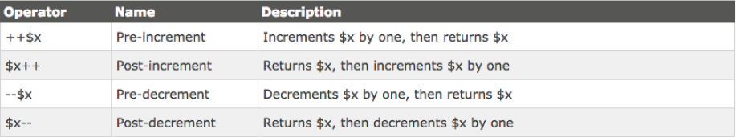
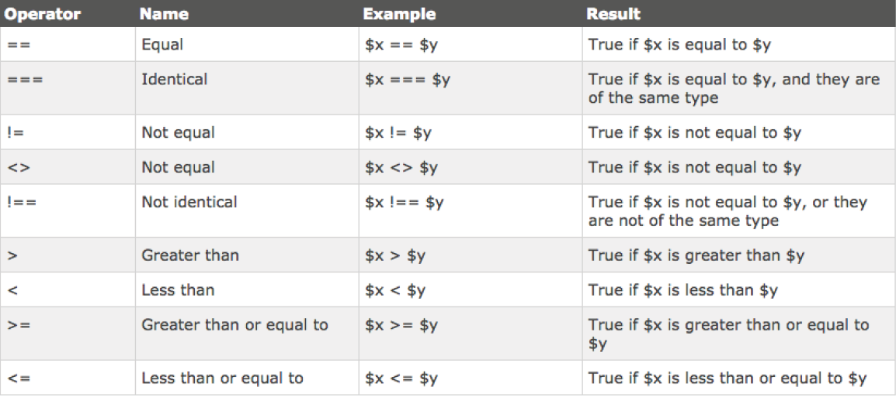
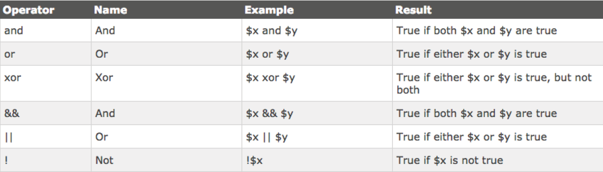

# INTRODUCTION


### 01. INTRODUCTION TO PHP

So, its time to get familiar with PHP. PHP is a dynamic server-side scripting language, many CMS’s like Wordpress make use of its functions and capabilities, so its about time you make use of it too. I’ll take you step by step through some of the basics as well as some of the features and functions that apply to Wordpress.

#### PHP stands for PHP Hypertext Preprocessor...um what? 

It sounds pretty stupid, but the first P in PHP stands for PHP...its actually a coding/ programmers/nerds gimmick. 

PHP is a free and open-source of language. Its paid alternative, ASP.NET you’ll also see knocking around the internet. PHP runs wordpress like we’ve discussed, but it also runs social networks like the almighty Facebook.

First of all, you need to understand one thing. PHP does not run in the browser...which means if you open up an index.php - all you’re going to get is the code your wrote spat out at you as you typed it. Markup and all.

You will need to run your index.php file through MAMP or upload it to a live server on the internet. Also, php syntax cannot live with in a .html file extension. Your index.html must now become a index.php if you want your PHP syntax to work.

PHP files can contain HTML, CSS and Javascript as well as PHP syntax of course. The code \(PHP\) is executed on the server, not the browser and code is generated from that execution and returned to the browser as HTML, CSS and sometimes Javascript.

#### So what can PHP do?

* Generate Dynamic Page content.
* Create, open, read, write, delete and close files on the server
* Collect and verify form data
* Interact with a Database like MySQL
* Page Restrictions like Login and Registration
* Encryption

So, lets write your first PHP function.

Copy the text below and save it in an index.php file.

```php
<!DOCTYPE html>
<html>
    <body>
    <?php echo “Hello, World”; ?>
    </body>
</html>
```

You’ll notice we still have an HTML 5 doctype declaration...Well, PHP is very similar to CSS or Javascript in the way that it communicates with the browser, so HTML is still at use here.

The echo function is commonly used for “printing” text to the screen. We’ll get into it in a bit though. Refresh your browser and take a look at the result. Simple text? Its not in a &lt;p&gt; tag though?

### 02. PHP SYNTAX

All PHP related code must be executed with in a PHP block.

We start a PHP block off as such:

`<?php`

Similar to an html tag, save for the question mark. and we end it with a:

`?>`

You must remember, with most scripting languages, that for every instruction you give the computer you must end it with a ; - just like we do in CSS.

Comments in PHP are written the same as in CSS for multiple lines, however you can comment single lines of code by using the :

`// This is a php comment for single lines`

`/* This is a php comment`

`for multiple lines of php syntax */`

Its also important to note that functions in PHP are not case sensitive unlike its cousin Javascript. you can write a function like:

**echo**

**or**

**ECHO**

**or**

**eCho**

**or**

**echO**

The only thing to remember is that PHP variables, when they are defined ARE case

sensitive, so:

**Red**

**and**

**red**

are two different variables as far as PHP is concerned.

### 03. VARIABLES

On a very basic level, variables “store” information.

Other than that, it means what its name implies - that it can store information that will always change. A simple example would be a volume slider on iTunes, the computer needs to perform a function based on information that has changed in volume based on user input - we don’t know what that variable value will always be, so hence the fact for declaring a variable? We can then run our code the same way with a more dynamic value.

**In PHP, we use the $ to declare a variable:**

`$z = 5`

The value 5 will be stored in the variable $z. You might find your algebra from school coming into play here.

**Lets consider the following:**

`$x = 5`

`$z = 2`

`$y = 3`

In PHP I could say $x &lt; $y

Essentially meaning - 5 is less than 3.

There are a few rules that govern variables: Like we’ve discussed, a variable must always start with a $ then the name you want to assign it.

* A variable can never start with a number or underscore.
* A variable can only accept alphanumeric characters and underscores.
* A variable is always considered to be case sensitive.

**Text vs Numbers**

While writing variables its important to know their meaning and how they are written:

**Text Value:**

`$name = “Daine”`

**Text Value Integer**

`$x = “5”`

**Integer**

`$y = 5`

You may be asking yourself what the difference between the “5” and the 5 is? Actual numbers don’t require double quotes, they are what they are, quantitative numbers. When we write “5” like this however, PHP does not consider it to be a number. PHP also has whats known as Variable Scope, there are 3 different types of scope:

`local`

`global`

`static`

This subject really has to do with more advanced PHP than you’re ready for just yet, so we’ll refer back to it when its necessary.


### 04. ECHO AND PRINT

We’ve already come across the echo function. Echo is a way of sending output to the

browser.

`<?php`

`echo “Hello!”`

`?>`

Will literally send the output Hello! to the browser. You can also output multiple “strings” anything in quotation marks are known as strings. Like so:

```php
<?php
echo “Hello!”;
echo “How are you?”;
?>
```

The print function only outputs 1 string at a time:

```php
<?php
print “Hello, there”;
?>
```

The one useful function of echo is that it can contain HTML...hopefully the puzzle pieces are clicking now:

```php
<?php
echo “<h2>Products</h2>”
?>
```

You can even echo out variables:

```php
<?php
$school = “Friends of Design”;
echo “You should study at $school”;
?>
```

You can decide whether or not to use echo or print - echo is more common and a lot faster. I tend to use echo, as the print function in Javascript will actually print anything in the “quotations” for you...

**PHP Strings and Integers**

Like you know by now, anything contained with in a “quotation” is considered to be a string. You can use single or double quotes. An integer refers to a number without any decimal points. It must contain at least one digit, so 2. It cannot contain any comma’s or blanks. It can’t have a decimal point. 

It can however be positive or negative.

PHP can also accept Booleans, a boolean is either true or false, and these values can be stored with in variables:

`$e = true;`

`$t = false;`

### 05. ARRAYS

A variable can only store one piece of information, but an Array can store multiple. We get into arrays with more detail later in this course.

The syntax for an array looks like this:

```php
<?php
    $cars = array(“BMW”, “Mercedes”, “Bently”);
?>
```

Arrays require a bit more functionality in order to be really useful, for now, just understand that we use an array to store lists or items of a particular category.

### 06. OBJECTS

There is such a concept in Computer Programming known as Object Orientated Programming. An object - to be really simple, is a “thing” that can perform a set of activities. These activities define the objects behaviour.

An example would be, lets say we have an object called “StudentMarks” we can write code with in that object to specify what courses they are taking and their average marks.

A “Student” object would maybe tell you the students name and address.

We will look more deeply into this in later modules.

Lastly, variables can also contain a special value, which is called NULL. Null, means nothing.

You can have a variable like:

`$x = null;`

### 07. STRING FUNCTIONS 08. CONSTANTS

Most scripting languages have a way to access and manipulate text that exist within strings. These are know as string functions.

We’ll go through a few of them here:

We can find out the length of a string by typing:

`<?php echo strlen(“Hello world!”); ?>`

PHP should return 12 - the space is counted as a character swell.

The next function will search for a specified character\(s\) with in a string:

`<?php echo strpos(“Hello world!”,”world”); ?>`

We first declare our string “Hello world!” and then use a comma to tell PHP what it is we are looking for, in this case “world”. Remember the white space is counted, so the browser will return 6.

### 08. Constants

Similar to a variable, PHP Constants cannot be changed.

It is simply an identifier for a certain value. Lets take a look at the example below:

```php
<?php
define(“HELLO”, “Welcome to Friends of Design”);
echo HELLO;
?>
```

Here we tell PHP to store “Welcome to Friends of Design” in “HELLO”. We use the define function to tell PHP to do so.

Consider the code below:

```php
<?php
define(“HELLO”, “Welcome to Friends of Design”, true);
echo hello;
?>
```

All constants take 3 parameters.

define\(“name”, “value”, true or false about case sensitivity\);

You can see that our “HELLO” name is written as “hello” in our echo - but because our case sensitivity is set to true - the function becomes case-insensitive.

### 09. OPERATORS

Most programming languages have a number of arithmetic operators. You should be familiar with most of them.


There are some more complicated ones, but these will suffice for now.

```php
<?php
$x=10; // declare variable x
$y=6; // declare variable y
echo ($x + $y); // outputs 16
?>
```

We also have string operators:

. for concatenation in other words:

`$txt1 = “Hello”`

`$txt2 = $txt1 . “ world!”`

`or`

`$x = “Hello”;`

`$x .=“ world!”;`

`echo $x;`

The .= will concatenate and the world! to Hello to create a full string.

It is also useful to Increment PHP values:



Heres an example:

`<?php`

`$x=10; echo ++$x; // outputs 11 ?>`

You find that using Comparison Operators are the easiest way to create well structured

logic:



In PHP we also have Logical Operators to play with:



### 10. CONDITIONAL STATEMENTS

Conditional Statements allow you to execute code or actions based on certain conditions.

In PHP we have:

**if statements -** will only execute code if a condition is true

**if / else statements -** executes some code if a condition is true and another code if the condition is false

**if...elseif....else statement -** selects one of several blocks of code to be executed switch statement - selects one of many blocks of code to be executed

if statement:

`if (condition) {`

`code to be executed if condition is true;`

`}`

Lets use an example:

```php
<?php
$time=date(“H”);
if ($t<”20”) {
echo “Have a good day!”;
}
?>
```

We create a time variable and store PHP’s function to get the date and narrow it down to Hours in its parameter.

In the if statement, we ask if the current time is less than “20” hours, echo out “Have a good day!”

If / Else Statements

`if (condition) {`

`code to be executed if condition is true;`

`} else {`

`code to be executed if condition is false;`

`}`

This statement holds two arguments. It asks if the condition in the if is true, if it is, it executes code. Then in the else, if the statement is false, it executes another bit of code.

```php
<?php
$t=date(“H”);
if ($t<”20”) {
echo “Have a good day!”;
} else {
echo “Have a good night!”;
}
?>
```

If / else if else Statement

You can use the statement if you need to apply a number of code blocks to be executed: 

`if (condition) {`

`code to be executed if condition is true;`

`} elseif (condition) {`

`code to be executed if condition is true;`

`} else {`

`code to be executed if condition is false;`

`}`

The example below will execute “Have a good morning” if the current time is less than 10AM, “Have a good day” if the current time is less than 20PM or otherwise, will echo out “Have a good night!”

```php
<?php
$t=date(“H”);
if ($t<”10”) {
echo “Have a good morning!”;
} elseif ($t<”20”) {
echo “Have a good day!”;
} else {
echo “Have a good night!”;
}
?>
```

### 11. WHILE LOOPS 12. PHP FUNCTIONS

In relation to Wordpress, the While Loop is a very important part! In order to constantly update posts, Wordpress uses a while loop to cycle through the posts in the database as news are added. Lets look at basic While Loop syntax:

`while (condition is true) {`

`code to be executed;`

`}`

They are very similar to if/else statements, save for the fact that this particular Loop will only cycle through a given block of code if a condition is true. For instance, if there are posts in the database, cycle through them.

```php
<?php
$x=1;
while($x<=5) {
echo “The number is: $x <br>”;
$x++;
}
?>
```

In this piece of code, the following happens:

1.  We set a variable “x” equal to 
2. We ask PHP if “1” is less than or equal to 5”
3. If that is true, then we echo out “The number is $x” and increment it by one.
4. The while loop will constantly spit out feedback as long as the condition is true.

### 12. PHP FUNCTIONS

We’ll come across functions very often while building Wordpress content, so its good to understand what a function is in its bare form: A function is a block of statements that can be repeatedly used in a program. It wont run as the page loads, but only when we call to the function to run. A function name cannot start with a number. Only a letter or underscore. Most importantly, you should name the function as by what its purpose is.

`function functionName(){`

`code to be executed;`

`}`

You need to use the keyword “function” to tell PHP you are indeed creating a function, then the name, and similar to CSS, the code to be executed in {} brackets. Lets test one out:

```php
<?php
function HelloWorld() {
echo “Hello world!”;
}
HelloWorld(); // call the function
?>
```

As you would have guessed, this function will simply output “Hello, world!” on to the screen. PHP functions can also contain what are known as arguments, these arguments exist between the parenthesis of the function name:

```php
<?php
function familyName($fname,$year) {
echo “$fname Mawer. Born in $year <br>”;
}
familyName(“Daine”,”1989”);
familyName(“Byron”,”1992”);
familyName(“Clive”,”1950”);
?>
```

The function below has two arguments. You can think of arguments, similar to variables. Theres 3 things you need to be aware of here. We create a function called familyName and pass 2 arguments through it:

`1. $fname`

`2. %year`

The code to be executed is “$fname Mawer. Born in $year”

Once we’ve closed our curly brackets, we call the function as many times as needed, but based on information that we input.

The code will run, and echo out something like this:

**Daine Mawer. Born in 1989**

**Byron Mawer. Born in 1992**

**Clive Mawer. Born in 1950**

We could also add another argument to specify the relationship.

Add $relationship to the argument in the function, separately by a comma, and then the input in the call to the functions:

```php
<?php
function familyName($fname,$relationship,$year) {
echo “$fname Mawer. Relationship: $relationship Born in
$year <br>”;
}
familyName(“Daine”,”Son”,”1989”);
familyName(“Byron”,”Brother”,”1992”);
familyName(“Clive”,”Father”,”1950”);
?>
```


### 13. PHP ARRAYS

The last topic in this Introduction to PHP is Arrays:

An array can store multiple values inside of a variable. You can think of an array as a special kind of variable which can hold more than just one value. They are usually used for lists of items. Lets consider that we would like to make a healthy juice. Every juice we make can only have 3 fruits. If we were to store each fruit in a variable, it would look like this:

```php
<?php
$fruit1 = “apple”
$fruit2 = “carrot”
$fruit3 = “ginger”
?>
```

Hmm, possible, but not so practical if you had 300 fruits to choose from! With arrays, we can just create a name, so $fruits and then store as many values as we like inside of it:

`$fruits=array(“Apple”,”Carrot”,”Ginger”);`

`echo “I need “ . $fruits[1] . “, “ . $fruits[2] . “ and “ .`

`$fruits[3] . “ for my juice.”;`

**This code will output:**

I need Apple, Carrot and Ginger for my juice.

There a 3 different types of arrays that can be used with PHP, we wont go through all of them, but the most commonly used array in Wordpress is an Associative Array:

These basically have a property/value relationship. Lets say we wanted an array of fruits that had a property of fruit and the value was their respective calorie count:

`$fruits=array(“Apple”=>”135”,”Carrot”=>”300”,”Ginger”=>”43”);`

`echo “Apples have “ . $fruits[‘Apple’] . “ calories.”;`

The above echo will output:

Apples have 135 calories.

### 14. WHAT ELSE CAN PHP DO 

PHP can also be used to handle form data. Up until now, we have been mainly concerned with structuring and styling HTML forms, but we need a way to get the inputted information from the user and do something with it.

**There are mainly two methods used:**

* **GET**
* **POST**

PHP can also validate form data. If you’ve ever seen form fields go red or display a “require” - its validation. You can validate emails and names and other things. PHP can also connect to databases. This is important as we need to sometimes communicate with databases to store information or retrieve information stored in the database already. PHP can select, delete, insert and create in a given database.

We can even read files with PHP, or even more, create files on the server. You can create uploads too.

One very useful part of PHP is its ability to stitch all of these capabilities together to create complex systems like user registration, login sessions or show content to only registered users.

PHP also integrates smoothly with AJAX - Asynchronous Javascript and XML, which allows you to update parts of a website behind the scenes without refreshing the page. Just about every social media platform we have uses AJAX in its web pages.

Lastly, PHP can also send email! Yes, thats right. It has a built in function called mail\(\).

### 15. ADDING HTML WITH PHP


Just like you can echo out plain text in PHP, you might get to the point where you want to dynamically add HTML with a CSS class in order to style its output on the Front-End. This can be done in one of two ways:

Heres a few examples:

`<?php if(5 === 5){ ?>`

`<p class=“lead”>Duh!</p>`

`<?php } ?>`

Note here that the PHP tags are self contained - the PHP parts are PHP, the HTML is HTML and the closing PHP “}” is PHP. Read it carefully.

`<?php if(condition){`

`echo “<input type=\”text\”>”;`

`} ?>`

Here you might notice that we have “ in “ we will need to programmatically escape these by adding a “\” where a “ appears inside of a “”.

Alternatively:

`if(condition){`

`echo ‘<input type=”text”>’;`

`}`

Use **‘** quotes for your echo and place **“ ”** inside.

### 16. EXERCISES

1. Create a PHP variable and echo it
2. Create a PHP Function that defines a variable and echo’s it
3. Create a conditional statement that echos out “Thats Right” if the statement is true
4. Create an Array and echo out the 3rd item.

